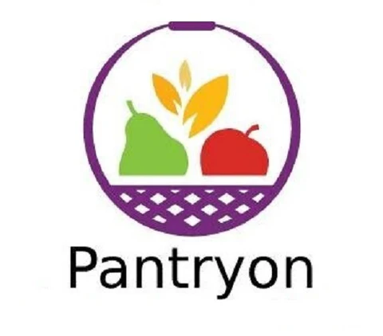
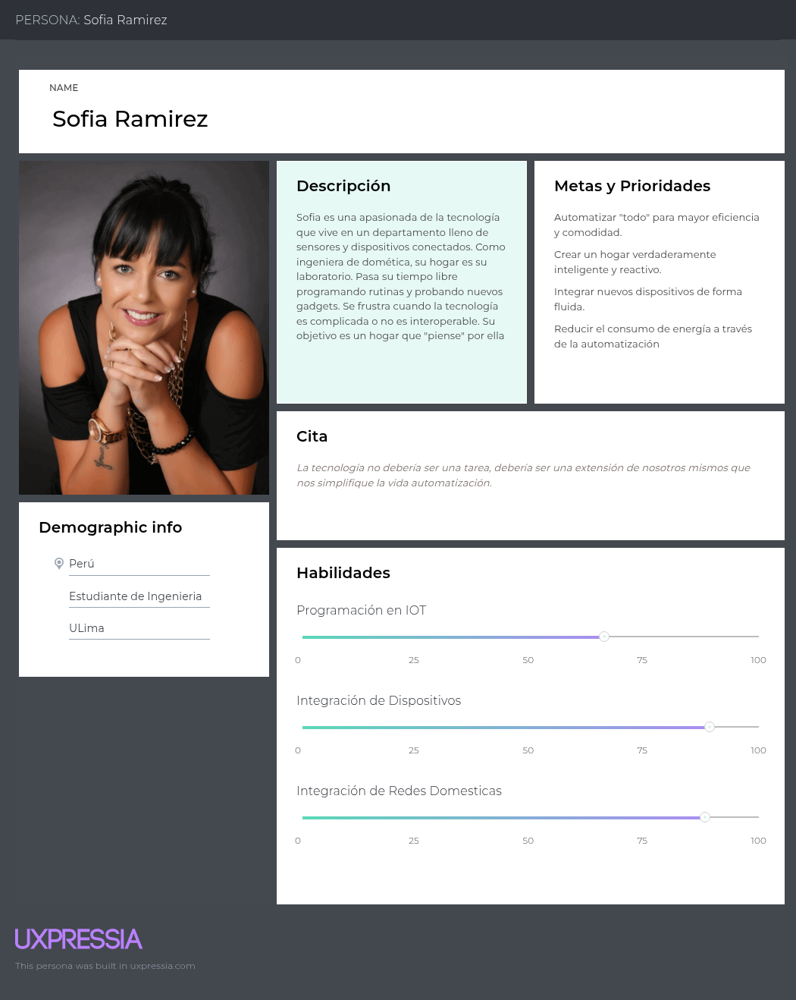
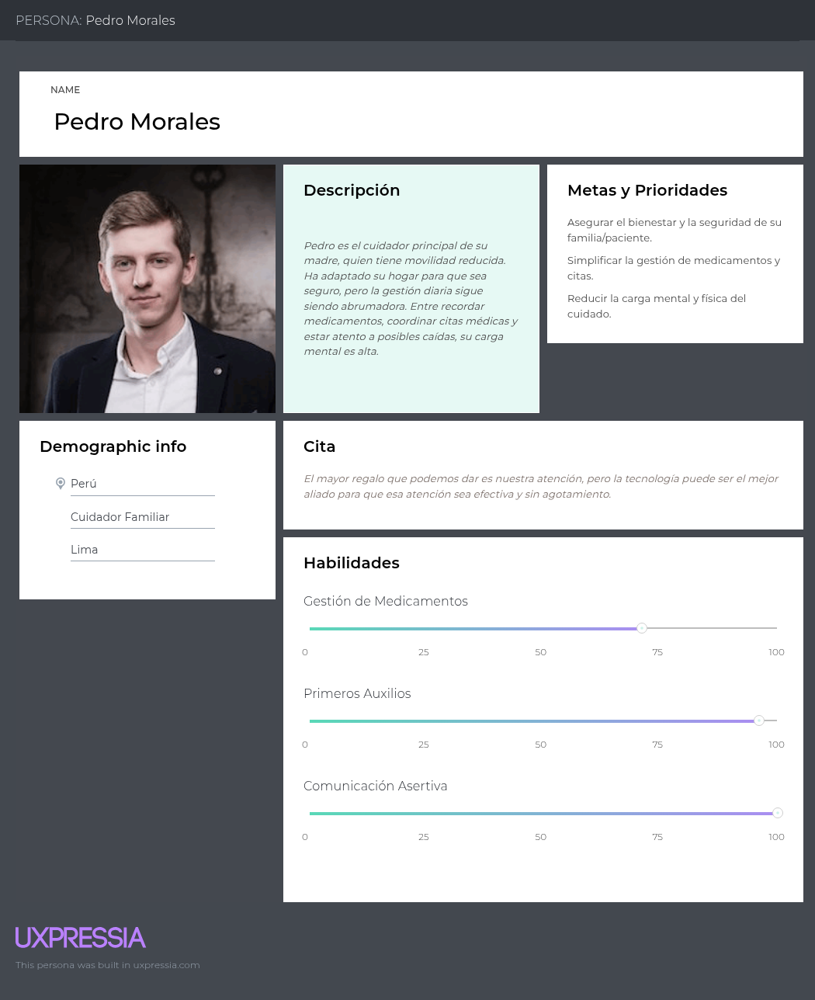
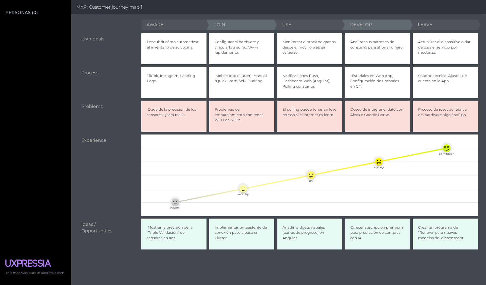
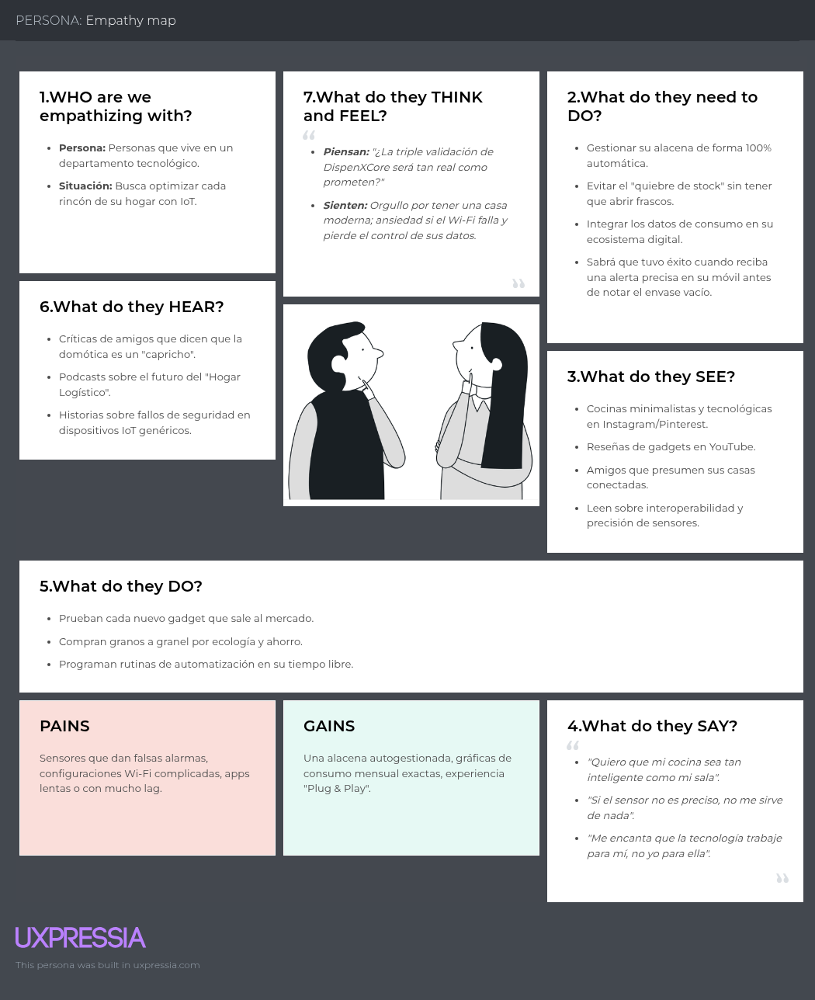
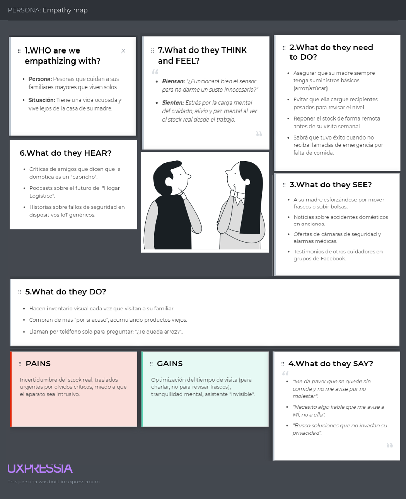
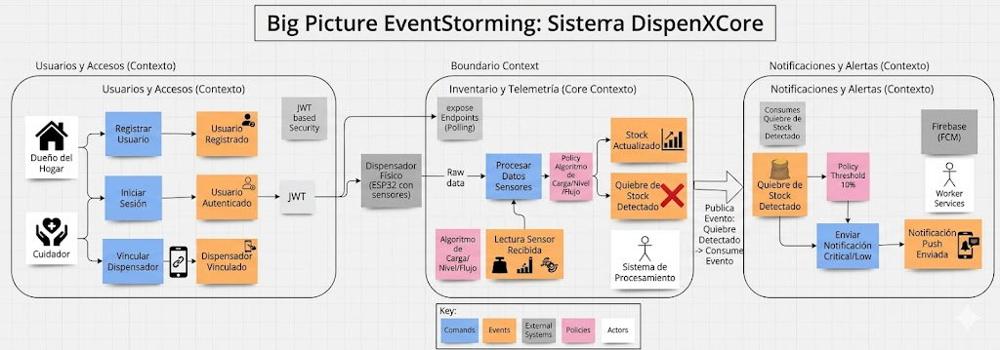

## **Capítulo II: Requirements Elicitation & Analysis**
- **2.1. Competidores**
   En esta sección se presentan los principales competidores del mercado de gestión de inventario doméstico y automatización de alacenas, detallando su alcance, canales de distribución y características distintivas.  

  | Competidor                                                 | Descripción                                                                                                                          | Características                                                                   | Logo                                                                                                                                                                                                                                 
  |-|-|-|--------------------------------------------------------------------------------------------------------------------------------------------------------------------------------------------------------------------------------------|
  | **Smart Pet Food Feeder (Xiaomi)**                                                  | Aunque enfocado en mascotas, es el referente más cercano en dispensadores conectados que monitorean stock y envían alertas al móvil.    | Canal de distribución: E-commerce, tiendas de tecnología y App Mi Home.           |  |
  | **PantryOn**    | Sistema de estantería inteligente con sensores de peso para monitoreo de despensa en tiempo real.  | Alertas de stock bajo, creación de listas de compras y visualización por app móvil. |   |
  | **Amazon Dash Smart Shelf**  | Balanza IoT de bajo perfil que automatiza la compra y reposición de suministros por peso.                 | Integración total con distribución/compras automáticas y notificaciones preventivas.                      |   |

    - **2.1.1. Análisis competitivo**
       En esta sección se identifica y compara a los principales competidores en el mercado de servicios técnicos, evaluando sus fortalezas, debilidades, alcance geográfico, estrategias de marketing y propuesta de valor.  

        <table>
        <tr>
        <th colspan="2" align="center">¿Por qué llevar a cabo este análisis?</th>
        <th colspan="5" align="center">Lo realizamos para identificar las brechas tecnológicas en el mercado de consumo humano y posicionar a DispenXCore como la solución líder en precisión y cuidado remoto de familiares.</th>
        </tr>
        <tr>
        <td colspan="2"></td>
        <td align="center"><b>DispenXCore</b></td>
        <td align="center">Xiaomi Smart Pet Feeder</td>
        <td align="center">PantryOn</td>
        <td align="center">Amazon Dash Smart Shelf</td>
        </tr>
        <tr>
        <td rowspan="2" align="center">Perfil</td>
        <td align="center"><b>Overview</b></td>
        <td align="center">Ecosistema IoT de dispensación inteligente para granos humanos con monitoreo de precisión y alertas push multiplataforma.</td>
        <td align="center">Alimentador automático para mascotas con conectividad Wi-Fi integrado al ecosistema de hogar inteligente de Xiaomi.</td>
        <td align="center">Sistema de bases y estantería inteligente que monitorea el peso de cualquier producto en la despensa para crear listas de compra.</td>
        <td align="center">Balanza inteligente de bajo perfil que detecta el agotamiento de suministros y realiza pedidos automáticos en Amazon.</td>
        </tr>
        <tr>
        <td align="center"><b>Ventaja competitiva

        ¿Qué valor ofrece a los clientes?</b></td>
        <td align="center">Triple validación de sensores (peso, nivel y flujo), enfoque en consumo humano y gestión remota para cuidadores.</td>
        <td align="center">Marca global reconocida, diseño industrial estético y sincronización con otros dispositivos de la marca.</td>
        <td align="center">Versatilidad total; permite monitorear cualquier recipiente u objeto colocado sobre sus bases inteligentes.</td>
        <td align="center">Logística de reposición automática (auto-replenishment) sin intervención manual del usuario.</td>
        </tr>
        <tr>
        <td rowspan="2" align="center">Perfil de Marketing</td>
        <td align="center"><b>Mercado objetivo</b></td>
        <td align="center">Hogares tecnológicos y cuidadores de adultos mayores o personas con movilidad reducida.</td>
        <td align="center">Dueños de perros y gatos que pasan mucho tiempo fuera de casa.</td>
        <td align="center">Personas enfocadas en la organización extrema y optimización del inventario de cocina.</td>
        <td align="center">Hogares y pequeñas oficinas que consumen productos de alta rotación (café, detergente, granos).</td>
        </tr>
        <tr>
        <td align="center"><b>Estrategias de marketing</b></td>
        <td align="center">Marketing de contenidos sobre "Smart Home" y soluciones de bienestar familiar; presencia en comunidades de tecnología.</td>
        <td align="center">Publicidad masiva en retail, posicionamiento en ecosistema Mi Home y marketing de influencia en mascotas.</td>
        <td align="center">Enfoque en blogs de organización doméstica y ahorro de tiempo en el supermercado.</td>
        <td align="center">Marketing directo dentro de la plataforma Amazon y beneficios para usuarios Prime.</td>
        </tr>
        <tr>
        <td rowspan="3" align="center">Perfil de producto</td>
        <td align="center"><b>Productos o servicios</b></td>
        <td align="center">Dispensador físico, Web App (Angular), App Móvil (Flutter) y notificaciones push en tiempo real.</td>
        <td align="center">Dispositivo dispensador de alimento seco y aplicación móvil integrada.</td>
        <td align="center">Bases sensoriales de peso y aplicación móvil de gestión de inventario.</td>
        <td align="center">Balanza inteligente con conexión directa a la cuenta de compras de Amazon.</td>
        </tr>
        <tr>
        <td align="center"><b>Precios y costos</b></td>
        <td align="center">Costo de hardware inicial y opción de suscripción premium para analítica de consumo.</td>
        <td align="center">Precio medio-alto por dispositivo, sin costos de suscripción adicionales.</td>
        <td align="center">Venta por unidad de base o estantes; costo escalable según la cantidad de productos.</td>
        <td align="center">Costo de hardware bajo, subsidiado por el compromiso de compra recurrente en Amazon.</td>
        </tr>
        <tr>
        <td align="center"><b>Canales de distribución

        (web y/o móvil)</b></td>
        <td align="center">Landing Page propia, tiendas de aplicaciones y canales directos de e-commerce.</td>
        <td align="center">Tiendas físicas (Xiaomi Store), Amazon, retail tecnológico y app Mi Home.</td>
        <td align="center">Página web oficial y marketplaces seleccionados.</td>
        <td align="center">Exclusivo a través del portal web y app de Amazon.</td>
        </tr>
        <tr>
        <td rowspan="4" align="center"><b>Análisis SWOT</b></td>
        <td align="center"><b>Fortalezas</b></td>
        <td align="center">Alta precisión por redundancia de sensores y capacidad de dispensación controlada.</td>
        <td align="center">Ecosistema maduro, facilidad de uso y excelente reputación de marca.</td>
        <td align="center">No requiere envases específicos; funciona con lo que el usuario ya tiene.</td>
        <td align="center">Integración logística imbatible y automatización total de la compra.</td>
        </tr>
        <tr>
        <td align="center"><b>Debilidades</b></td>
        <td align="center">Marca nueva en proceso de validación; requiere configuración inicial del hardware por el usuario.</td>
        <td align="center">Limitado a alimentos de mascotas; no apto para granos finos o consumo humano.</td>
        <td align="center">No es un dispensador; el usuario debe seguir manipulando los recipientes manualmente.</td>
        <td align="center">Dependencia total de Amazon; preocupaciones de privacidad por pesaje constante.</td>
        </tr>
        <tr>
        <td align="center"><b>Oportunidades</b></td>
        <td align="center">Alianzas con programas de asistencia social para el monitoreo de alimentación en ancianos.</td>
        <td align="center">Expandir la línea hacia dispensación de medicamentos o comida humana.</td>
        <td align="center">Venta de datos de consumo a marcas de alimentos para estudios de mercado.</td>
        <td align="center">Expandir a categorías de productos industriales o médicos.</td>
        </tr>
        <tr>
        <td align="center"><b>Amenazas</b></td>
        <td align="center">Entrada de competidores asiáticos con hardware genérico a bajo precio.</td>
        <td align="center">Aparición de dispensadores especializados con mayor capacidad de carga.</td>
        <td align="center">Apps de inventario visual por IA que no requieran hardware físico.</td>
        <td align="center">Cambios en las preferencias de los usuarios hacia compras locales y menos automatizadas.</td>
        </tr>
        </table>

    - **2.1.2. Estrategias y tácticas frente a competidores**
     Esta sección describe las acciones planificadas para diferenciar a DispenXCore frente a competidores en el mercado de la domótica, enfocándose en la precisión del hardware, la integración multiplataforma, la generación de tranquilidad para cuidadores y los beneficios por adopción temprana. Se busca fortalecer la posición en el mercado mediante la fiabilidad de los datos, la facilidad de configuración y la fidelización de los usuarios tecnológicos y responsables de familia.  
      **Propuesta de valor diferenciada:** Crear un ecosistema IoT que combine tres tipos de sensores (peso, nivel y flujo) para garantizar un monitoreo con margen de error cero, destacándose por transformar un contenedor pasivo en un asistente activo que previene el desabastecimiento de insumos básicos mediante alertas inteligentes.

      **Estrategia digital multicanal:** Posicionarse a través de campañas en plataformas visuales como Instagram y TikTok enfocadas en "Organización de Cocinas" y "Tecnología para el Hogar", además de publicidad segmentada para el nicho de cuidado de adultos mayores y foros de entusiastas del Smart Home.

      **Generación de confianza:** Implementar una política de transparencia de datos y precisión garantizada, mostrando en la aplicación el estado de salud de los sensores y utilizando testimonios de usuarios reales que lograron optimizar sus compras y evitar olvidos críticos gracias a las alertas.

- **2.2. Entrevistas**
    Esta sección agrupa todo el proceso relacionado con la realización de entrevistas a los segmentos objetivo de DispenXCore, incluyendo el registro de las mismas y el análisis de la información obtenida. Permite identificar necesidades, expectativas y puntos de dolor de los usuarios respecto a la gestión de su alacena e inventario de granos, sirviendo como insumo principal para el diseño y validación del producto IoT.  
    - **2.2.1. Diseño de entrevistas**

      Con el propósito de identificar de manera más clara las necesidades, comportamientos y expectativas de nuestros usuarios potenciales, hemos elaborado un conjunto de entrevistas. Estas están enfocadas en evaluar la aceptación y el interés por el ecosistema que plantea DispenXCore, tanto desde la perspectiva de hogares que buscan automatización como desde la de familiares encargados del cuidado y abastecimiento de adultos mayores.

      **Preguntas para el Segmento Objetivo 1: Entusiastas de la Automatización y Hogares Inteligentes**

        1. Actualmente, ¿cómo organizas y almacenas tus insumos a granel (arroz, azúcar, menestras, etc.)?

        2. ¿Con qué frecuencia te sucede que vas a cocinar y descubres que un ingrediente principal se ha agotado?
        3. Cuando eso sucede, ¿cómo afecta tu rutina o planificación del día?
        4. ¿Qué tan seguido terminas comprando un producto que ya tenías solo por no estar seguro de cuánto quedaba en la alacena?
        5. ¿Utilizas actualmente alguna aplicación o dispositivo inteligente para gestionar tareas del hogar? ¿Qué tal es tu experiencia?
        6. Si existiera un dispensador inteligente que te avise al celular antes de que se acabe el arroz, ¿qué valor le darías a esa notificación?
        7. Pensando en la aplicación móvil (Flutter) y web (Angular), ¿qué funciones te serían más útiles? (Gráficos de consumo, alertas personalizadas, lista de compras automática, etc.)
        8. ¿Qué tan importante es para ti que el dispositivo use varios sensores para asegurar que la medición sea exacta y no falle?
        9. ¿Estarías dispuesto a pagar una suscripción premium si la app te ofrece predicciones de cuándo deberías comprar basado en tus hábitos de consumo?
        10. ¿Qué esperas de un dispositivo IoT en términos de facilidad de configuración Wi-Fi y diseño para tu cocina?
        11. ¿Qué valorarías más en DispenXCore? (La precisión del peso, la comodidad de la app o el ahorro de tiempo en las compras).

      **Preguntas para el Segmento Objetivo 2: Cuidadores de Adultos Mayores o Personas con Movilidad Reducida**
        1. ¿Eres responsable de realizar las compras o supervisar el abastecimiento de alimentos en el hogar de un familiar adulto mayor?

        2. ¿Cómo te aseguras actualmente de que no les falten insumos básicos como arroz, azúcar o legumbres?
        3. ¿Cuántas veces a la semana o al mes debes trasladarte solo para verificar qué productos faltan en la despensa de tu familiar?
        4. ¿Qué tan preocupante resulta para ti que tu familiar se quede sin suministros básicos y deba salir de urgencia a comprarlos o se quede sin cocinar?
        5. ¿Qué dificultades encuentras al intentar gestionar el inventario de otra casa de forma remota?
        6. Si pudieras recibir una alerta en tu propio celular indicando que el arroz en casa de tu familiar está al 10%, ¿cómo cambiaría eso tu forma de organizar los suministros?
        7. ¿Qué funciones considerarías críticas en la aplicación para ayudarte en esta labor de cuidado? (Alertas críticas, historial de reposición, botón de compra directa, etc.)
        8. ¿Te daría más tranquilidad saber que el sistema cuenta con 3 sensores de validación para evitar errores en el reporte del inventario?
        9. ¿Crees que una herramienta como esta ayudaría a que tu familiar mantenga su independencia por más tiempo sin que tú tengas que estar físicamente presente para revisar la cocina?
        10. Pensando en DispenXCore, ¿qué función te resultaría más útil para reducir tu carga mental como cuidador?

- **2.2.2. Registro de entrevistas**
    En esta sección se recopilan las entrevistas realizadas a los dos segmentos objetivo: Profesionales Técnicos y Clientes. Se registran las respuestas, observaciones y comentarios clave de cada participante, sirviendo como base para el análisis de necesidades y la posterior definición de requisitos del sistema.  

  **Entrevistas Segmento Objetivo 1: Entusiastas de la Automatización y Hogares Inteligentes**

  **Entrevista 1:**

  Datos del entrevistado:
    - Nombre: Sebastian Silva
    - Edad:22 años
    - Distrito de residencia: San Luis
    - Enlace: https://upcedupe-my.sharepoint.com/:v:/g/personal/u202125968_upc_edu_pe/IQDBoeaDO5d4Q6h935nZ5j4uAR0XPnDof0ebNHzwjx6sHuk?e=mecImR&nav=eyJyZWZlcnJhbEluZm8iOnsicmVmZXJyYWxBcHAiOiJTdHJlYW1XZWJBcHAiLCJyZWZlcnJhbFZpZXciOiJTaGFyZURpYWxvZy1MaW5rIiwicmVmZXJyYWxBcHBQbGF0Zm9ybSI6IldlYiIsInJlZmVycmFsTW9kZSI6InZpZXcifX0%3D 

       
  **Resumen de la entrevista:** Sebastián Silva, de 22 años, gestiona sus insumos de cocina de forma manual, guiándose por observación. Con frecuencia (al menos una vez por semana) se queda sin ingredientes, lo que afecta su rutina, y a veces compra productos que ya tiene por falta de control.

  No utiliza herramientas tecnológicas, pero ve con interés un sistema inteligente que le avise sobre niveles de insumos. Le gustaría que incluya historial, gráficos y predicciones de consumo. Valora la precisión del sistema y consideraría pagar una suscripción solo si demuestra un ahorro real. También espera que sea fácil de usar y funcione en tiempo real.

 

  **Entrevista 2:**

  Datos del entrevistado:
    - Nombre: Sebastian Maguiña
    - Edad:28
    - Distrito de residencia: Miraflores
    - Enlace: https://upcedupe-my.sharepoint.com/:v:/g/personal/u202312318_upc_edu_pe/IQAno2LYPzBtRqMwF7g9EtnnAbHtE-kGSv_R5orSmqNDFFA?e=L4HhKX&nav=eyJyZWZlcnJhbEluZm8iOnsicmVmZXJyYWxBcHAiOiJTdHJlYW1XZWJBcHAiLCJyZWZlcnJhbFZpZXciOiJTaGFyZURpYWxvZy1MaW5rIiwicmVmZXJyYWxBcHBQbGF0Zm9ybSI6IldlYiIsInJlZmVycmFsTW9kZSI6InZpZXcifX0%3D

  

  **Resumen de la entrevista:** Sebastián Maguiña es un usuario con afinidad por la tecnología y hogares inteligentes, que actualmente gestiona sus insumos de forma manual pese a tener dispositivos automatizados en casa. Ocasionalmente se queda sin ingredientes clave y esto interrumpe su rutina, además de que compra productos duplicados por falta de visibilidad del stock.

  Utiliza asistentes y dispositivos inteligentes, pero identifica la ausencia de una solución integrada para inventario. Valora altamente un sistema con alertas predictivas, dashboards claros y automatización de compras. Considera fundamental la precisión de los sensores y estaría dispuesto a pagar una suscripción si realmente optimiza su tiempo. También espera una configuración sencilla, integración fluida y un diseño acorde a un ecosistema smart.

  **Entrevista 3:**

  Datos del entrevistado:
    - Nombre: Ricardo Ccahuana
    - Edad: 25
    - Distrito de residencia: Surco
    - Enlace: 

       
  **Resumen de la entrevista:** Ricardo es un usuario orientado a la organización y tecnología, que mantiene sus insumos en frascos etiquetados, pero con un control aún manual. Aunque no le ocurre con mucha frecuencia, a veces se queda sin ingredientes o compra de más por falta de visibilidad, lo que afecta su eficiencia y rompe la sensación de control en su hogar.

  Utiliza varios dispositivos inteligentes, pero percibe una clara falta de integración en la gestión de inventario de alimentos. Valora especialmente las alertas anticipadas, la visualización clara de datos y la integración con otros dispositivos del hogar. Considera fundamental la precisión del sistema para poder confiar en la automatización y estaría dispuesto a pagar por una suscripción si las predicciones son realmente útiles. También espera que el dispositivo sea fácil de configurar  y tenga un diseño minimalista acorde a su entorno.

  **Entrevistas Segmento 2: Cuidadores de Adultos Mayores o Personas con Movilidad Reducida**

  **Entrevista 1:**

  Datos del entrevistado:
    - Nombre: Fabrisio Belahonia
    - Edad:25
    - Distrito de residencia: Ate
    - Enlace: https://upcedupe-my.sharepoint.com/:v:/g/personal/u202125968_upc_edu_pe/IQBgCxzDiZTORYB3iyVK-GMwAa88j5g9Pd5x5erz5c4qldQ?e=uA5NcA&nav=eyJyZWZlcnJhbEluZm8iOnsicmVmZXJyYWxBcHAiOiJTdHJlYW1XZWJBcHAiLCJyZWZlcnJhbFZpZXciOiJTaGFyZURpYWxvZy1MaW5rIiwicmVmZXJyYWxBcHBQbGF0Zm9ybSI6IldlYiIsInJlZmVycmFsTW9kZSI6InZpZXcifX0%3D

       
  **Resumen de la entrevista:**
    Fabricio Belahonia, de 25 años, se encarga de las compras y el abastecimiento para un adulto mayor, gestionando los insumos de forma manual mediante revisiones y notas. Esto lo obliga a visitar la vivienda varias veces por semana y le genera incertidumbre por la falta de visibilidad remota.

    Considera que un sistema con alertas en tiempo real le ayudaría a planificar mejor, evitar viajes innecesarios y reducir su carga mental. Además, valora funciones como historial de consumo, listas automáticas de compra y alta precisión en las mediciones.

  **Entrevista 2:**

  Datos del entrevistado:
    - Nombre:
    - Edad:
    - Distrito de residencia: 
    - Enlace: 

       
  **Resumen de la entrevista:**

  **Entrevista 3:**

  Datos del entrevistado:
    - Nombre:
    - Edad:
    - Distrito de residencia: 
    - Enlace: 

       
  **Resumen de la entrevista:**

- **2.2.3. Análisis de entrevistas**
    En este apartado se documenta el análisis de las entrevistas realizadas a los dos segmentos objetivo: Hogares Tecnológicos y Cuidadores de Adultos Mayores. El propósito es identificar patrones, necesidades, frustraciones y expectativas de cada grupo para fundamentar el diseño del sistema y priorizar funcionalidades en el ecosistema de DispenXCore.   
  **Análisis Segmento Objetivo 1: Profesionales Tecnicos**

  Resumen 1.

  **Analisis Segmento Objetivo 2: Cuidadores de Adultos Mayores**

  Resumen 2.

  ####   Conclusión
  Conclusión.

- **2.3. Needfinding**
  El Needfinding es una metodología cualitativa enfocada en recoger las opiniones y emociones de los usuarios. Su objetivo, como indica su nombre, es identificar, explorar, analizar, descubrir y evaluar de forma clara las necesidades que pueden guiar el desarrollo y diseño de cualquier proyecto.

  En este proyecto, hemos decidido interactuar con posibles usuarios mediante entrevistas y cuestionarios. A continuación, se presentan diversos análisis obtenidos a partir de estas entrevistas en los siguientes documentos
    - **2.3.1. User Personas**
      En esta sección se presentan los perfiles representativos de los usuarios del sistema, permitiendo identificar características, motivaciones y necesidades de cada segmento para guiar el desarrollo de funcionalidades y la experiencia de usuario.   
    **Segmento Objetivo 1: Entusiastas de la Automatización y Hogares Inteligentes**
          
    **Segmento Obvetivo 2: Cuidadores de Adultos Mayores o Personas con Movilidad Reducida**
          

    - **2.3.2. User Task Matrix**

      Esta herramienta permite identificar y clasificar las actividades clave que realiza cada segmento dentro del ecosistema IoT, considerando la frecuencia con la que las llevan a cabo y el nivel de importancia que representan para cumplir sus objetivos de gestión de inventario.
      | Tarea | Hogares Inteligentes (Frecuencia / Importancia) | Cuidadores (Frecuencia / Importancia) |
      |---|---|---|
      | Registrarse y configurar perfil de usuario | Baja / Alta | Baja / Alta |
      | Vincular el dispensador físico a la red Wi-Fi | Baja / Alta | Baja / Alta |
      | Consultar el estado del stock (Polling en App/Web) | Frecuente / Media | Frecuente / Alta |
      | Recibir notificaciones push de "Stock Bajo" | Ocasional / Alta | Ocasional / Crítica |
      | Configurar umbrales de alerta (ej: avisar al 15%) | Baja / Media | Baja / Alta |
      | Revisar historial y gráficas de consumo | Frecuente / Alta | Baja / Media |
      | Gestionar múltiples dispensadores (Arroz, Azúcar, etc.) | Media / Alta | Media / Alta |
      | Verificar el estado de los sensores y batería | Baja / Media | Media / Alta |

      Del análisis de esta matriz para el proyecto DispenXCore, se observa que:

      - Para los Hogares Inteligentes, la tarea más relevante es la revisión de historiales y gráficas, ya que este perfil busca optimizar sus hábitos de consumo y disfruta de la interacción con los datos que provee el sistema en Angular.

      - Para los Cuidadores, las tareas críticas son la recepción de notificaciones push y la configuración de umbrales, ya que su objetivo principal es la logística de reposición remota. Para ellos, una alerta a tiempo es la diferencia entre un familiar abastecido o desatendido.

      - Finalmente, la capacidad de gestionar múltiples dispositivos es una tarea de importancia alta para ambos, permitiendo que la plataforma escale de un solo dispensador de arroz a un sistema completo de alacena inteligente.
    - **2.3.3. User Journey Mapping**
      En esta seccion describiremos visualmente las interacciones de los usuarios con el sistema, mostrando los pasos, emociones y puntos de contacto clave.  
      **Segmento Objetivo 1: Entusiastas de la Automatización y Hogares Inteligentes**

      

      **Segmento Obvetivo 2: Cuidadores de Adultos Mayores o Personas con Movilidad Reducida**

      

    - **2.3.4. Empathy Mapping**  
      **Segmento Objetivo 1: Entusiastas de la Automatización y Hogares Inteligentes**

    
    
    **Segmento Obvetivo 2: Cuidadores de Adultos Mayores o Personas con Movilidad Reducida**

    
- **2.4. Big Picture EventStorming**

    
- **2.5. Ubiquitous Language** 
  - Smart Dispenser (Dispensador Inteligente): Dispositivo físico encargado de almacenar, proteger y medir la cantidad de granos o insumos secos en su interior.

  - Bulk Supplies (Insumos a Granel): Productos alimenticios secos y granulares (arroz, azúcar, lentejas, etc.) que se almacenan sin empaque individual dentro del dispositivo.

  - Stock Level (Nivel de Existencias): Cantidad actual de insumo disponible dentro del dispensador, representada generalmente en porcentaje de volumen o peso en gramos.

  - Alert Threshold (Umbral de Alerta): Límite mínimo de producto configurado por el usuario (ej. 15%) que, al ser alcanzado, activa una advertencia de necesidad de compra.

  - Critical Low (Nivel Crítico Bajo): Estado en el que la cantidad de grano es insuficiente para una ración estándar, indicando un desabastecimiento inminente.

  - Consumption Pattern (Patrón de Consumo): Comportamiento histórico de uso de un insumo específico que permite identificar con qué frecuencia y en qué cantidad se agotan los suministros.

  - Remote Monitoring (Monitoreo Remoto): Capacidad de supervisar el estado de la alacena desde una ubicación distinta a donde se encuentra el dispositivo físico.

  - Caregiver (Cuidador): Rol de usuario responsable de supervisar el abastecimiento de alimentos de un tercero, generalmente un adulto mayor o persona con movilidad reducida.

  - Smart Pantry (Alacena Inteligente): Concepto de gestión del hogar donde los recipientes de comida están conectados y son capaces de reportar su estado de inventario.

  - Out of Stock / Depletion (Agotamiento de Stock): Condición en la cual el dispensador se encuentra totalmente vacío, impidiendo la preparación de alimentos.

  - Granular Flow (Flujo Granular): El movimiento físico de los granos al salir del dispensador, cuya detección confirma que el dispositivo está operando correctamente y no presenta obstrucciones.

  - Replenishment (Reposición): Acción física de rellenar el dispensador con nuevo producto una vez que el nivel de existencias es bajo.

  - Telemetry (Telemetría): El conjunto de mediciones físicas (peso, distancia y presencia) recolectadas por el dispositivo para determinar el estado real del inventario.
