<div style="page-break-after: always;"></div>

## Capítulo VI: Product Implementation & Validation

---

### 6.1. Software Configuration Management

En esta sección definimos las reglas que permiten mantener la cohesión del proyecto de principio a fin, abarcando la configuración del entorno de desarrollo, la gestión del código fuente, las convenciones de estilo y el proceso de despliegue.

<br>

#### 6.1.1. Software Development Environment Configuration

Para garantizar la eficiencia en el desarrollo de DispenXCore, nos apoyamos en el siguiente conjunto de herramientas, organizadas según su propósito dentro del ciclo de vida del proyecto.

<br>

##### Requirements Management

- **UxPressia**

  Esta plataforma, dedicada a la gestión de componentes de UX, fue el eje para el desarrollo de la etapa de descubrimiento. En ella se diseñaron los entregables clave: User Personas, Journey Maps, Empathy Maps e Impact Maps, fundamentales para el análisis de necesidades.

  <p align="center">
    
  </p>

<br>

##### Product UX/UI Design

- **Figma**

  Para la construcción de la capa de presentación y prototipos dinámicos, empleamos una herramienta de trabajo compartido. Su capacidad de simulación fue fundamental para verificar la efectividad de la navegación y asegurar una experiencia de usuario fluida.

  <p align="center">
    
  </p>

<br>

##### Software Development

- **Visual Studio Code**

  La arquitectura del frontend de la landing page se desarrolló utilizando el editor de código de Microsoft, integrando HTML, CSS y JavaScript para consolidar la interfaz del usuario. Utilizamos el editor de Microsoft como herramienta principal de programación para materializar la landing page, gestionando todo el desarrollo desde este entorno.

  <p align="center">
    
  </p>

- **Rider**

  Entorno de desarrollo oficial de JetBrains basado en C#. Empleado para el desarrollo nativo de la aplicación backend en .NET propuesta en el proyecto.

  <p align="center">
    
  </p>

<br>

##### Software Deployment

- **Git**

  Esta herramienta de gestión de versiones descentralizada garantiza la trazabilidad total de los cambios, optimizando la integración del trabajo realizado por los distintos desarrolladores. Se implementó un sistema distribuido para salvaguardar el historial evolutivo del código, permitiendo una sincronización fluida y segura entre todos los colaboradores.

  <p align="center">
    
  </p>

- **GitHub**

  Este servicio de alojamiento potencia la sinergia del equipo mediante flujos de integración continua y una gestión estructurada de ramas. Asimismo, se vincula con un sistema de despliegue automático para mantener la landing page siempre actualizada. Se utiliza esta infraestructura para centralizar el código, facilitando el desarrollo paralelo y la validación mediante CI. Adicionalmente, se aprovechan sus capacidades de hosting estático para automatizar la publicación del sitio web.

  <p align="center">
    
  </p>

- **Netlify**

  Plataforma de despliegue continuo utilizada para publicar la landing page de DispenXCore. Permite la integración automática con el repositorio de GitHub, generando un enlace público accesible desde cualquier dispositivo y manteniendo el sitio actualizado tras cada cambio en la rama principal.

<br>

---

<br>

#### 6.1.2. Source Code Management

La gestión del proyecto de la aplicación móvil, landing page y aplicación backend siguen los principios del modelo **Git Branch Model**, una estrategia para administrar y organizar el trabajo en un repositorio de GitHub mediante la creación de ramas con distintas funcionalidades. Adicionalmente, aplicamos **Git Flow**, que define cómo crear ramas para mantener el control del ciclo de vida del desarrollo del software.

<br>

##### Repositorios del proyecto

- **Repositorio del Reporte:** [DispenXCore--Report](https://github.com/1ASI0572-2610-17755-G4-DispenXCore/DispenXCore--Report)
- **Repositorio del Landing Page:** [DispenXCore-Landing](https://github.com/1ASI0572-2610-17755-G4-DispenXCore/DispenXCore-Landing)
- **Repositorio del Frontend:** [DispenXCore-Web-FrontEnd](https://github.com/1ASI0572-2610-17755-G4-DispenXCore/DispenXCore-Web-FrontEnd)
- **Repositorio del Backend:** [DispenXCore-Web-Backend](https://github.com/1ASI0572-2610-17755-G4-DispenXCore/DispenXCore-Web-Backend)

<br>

##### Estructura de ramas

**1. Rama `main` (rama principal).** Esta rama resguarda las versiones finales del código. Todo cambio debe validarse y probarse primero en otras ramas antes de integrarse.

**2. Rama `develop` (rama de desarrollo).** En esta rama se concentra el trabajo colaborativo, incorporando gradualmente cada funcionalidad hasta que se estabilice y pueda fusionarse con `main`.

**3. Rama `feature/*` (ramas de características).** Estas ramas, derivadas de `develop`, se usan únicamente para crear nuevas funcionalidades. Cuando se implementan y validan, vuelven a integrarse en la rama de desarrollo. Aunque suelen ser temporales, en el caso de la Landing Page se conservarán con fines documentales.

**4. Convenciones de commits.** Para los mensajes de commit, seguimos la especificación **Conventional Commits** con la siguiente estructura:

```
(tipo): (título)

(descripción)
```

<br>

---

<br>

#### 6.1.3. Source Code Style Guide & Conventions

Para construir DispenXCore, utilizamos los siguientes lenguajes y tecnologías, cada uno con sus respectivas guías de estilo y convenciones.

<br>

##### Angular

Como framework para el desarrollo del frontend web, se aplicaron estas prácticas:

- **Estructura del proyecto:** se mantuvo una organización modular con directorios `app/` para componentes principales, `shared/` para elementos reutilizables y `core/` para servicios y configuración global.
- **Componentes reutilizables:** se aplicó el principio de separación de responsabilidades, dividiendo la lógica entre componentes presentacionales y contenedores.
- **Lazy loading:** se implementó carga diferida de módulos para optimizar el rendimiento inicial de la aplicación.

<br>

##### CSS

Se siguió la metodología **BEM** junto con guías de estilo definidas:

- **Nomenclatura descriptiva:** las clases se escriben en formato `kebab-case` en inglés para identificar claramente su función.
- **Mejoras en la experiencia de usuario:** se incorporaron transiciones suaves en las interacciones y efectos en botones.
- **Recursos tipográficos:** se optimizó la carga de tipografías personalizadas mediante `@font-face`, respetando buenas prácticas de rendimiento.

<br>

##### .NET

En el desarrollo de la API RESTful se aplicaron las convenciones recomendadas por Microsoft:

- **Convenciones de nomenclatura:** se emplea `PascalCase` en clases y métodos, y `lowerCamelCase` en parámetros y variables.
- **Arquitectura limpia:** se implementó Clean Architecture junto con principios de Domain-Driven Design, estructurando el proyecto en capas separadas (Aplicación, Infraestructura, Dominio y Presentación).

<br>

---

<br>

#### 6.1.4. Software Deployment Configuration

Para el despliegue de la Landing Page utilizamos **Netlify**, aprovechando su servicio de integración continua con GitHub para mantener el sitio actualizado automáticamente con cada push a la rama principal.

A continuación se detalla el proceso paso a paso para desplegar la landing page de DispenXCore en Netlify, integrándola con el repositorio de GitHub del proyecto.

<br>

**Paso 1.** Ingresamos a Netlify y seleccionamos la opción **Import from Git**.

<p align="center">
  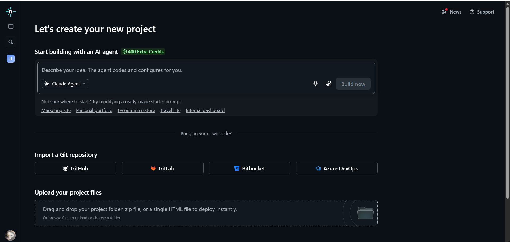
</p>

<br>

**Paso 2.** Elegimos importar un proyecto desde **GitHub**.

<p align="center">
  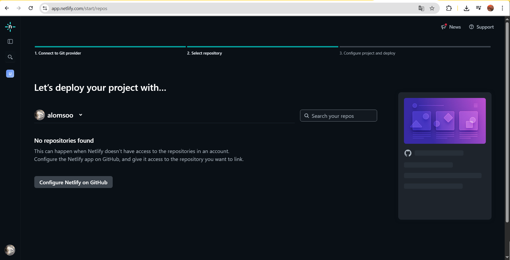
</p>

<br>

**Paso 3.** Configuramos o enlazamos Netlify con nuestra cuenta de GitHub.

<p align="center">
  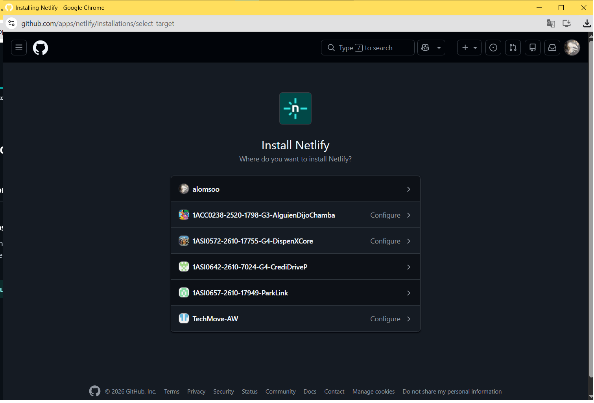
</p>

<br>

**Paso 4.** Seleccionamos la organización donde se encuentra nuestro repositorio.

<p align="center">
  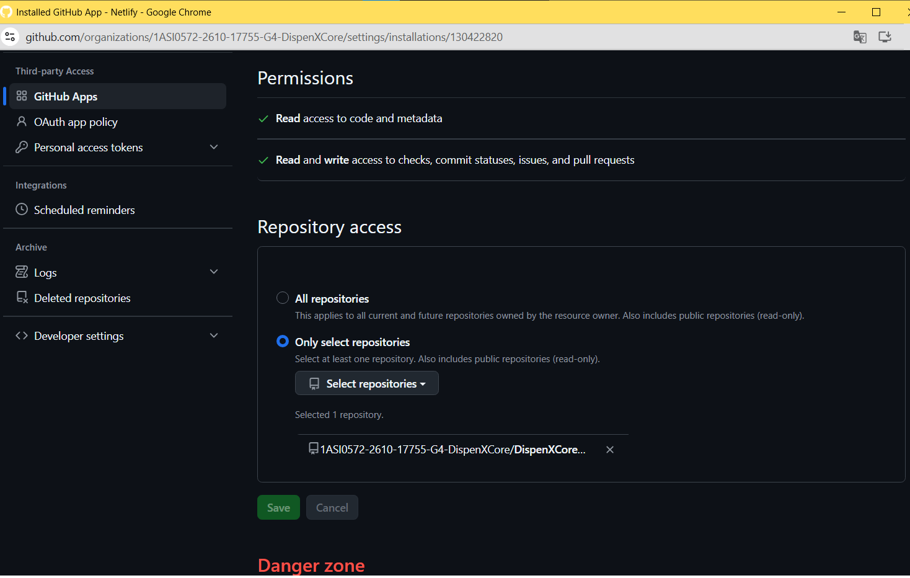
</p>

<br>

**Paso 5.** Seleccionamos el repositorio correspondiente al landing page de DispenXCore.

<p align="center">
  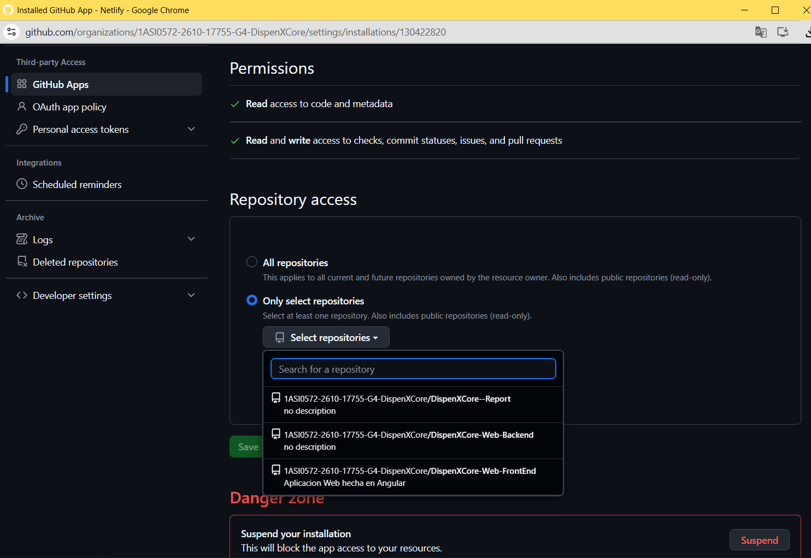
</p>

<br>

**Paso 6.** Definimos el nombre del subdominio que tendrá nuestro sitio publicado.

<p align="center">
  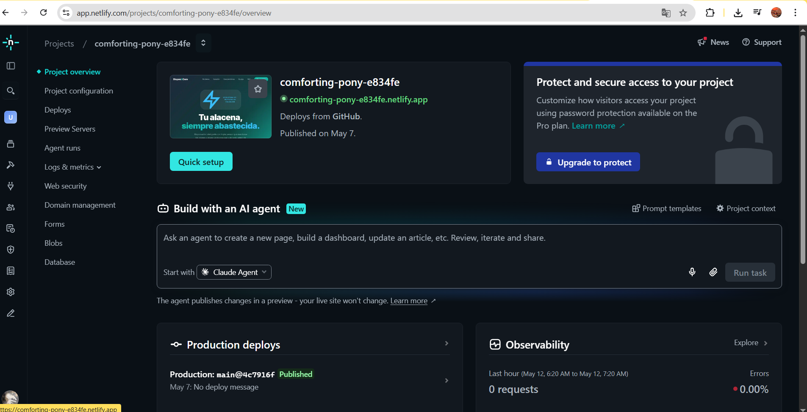
</p>

<br>

**Paso 7.** Configuramos las variables de entorno necesarias y presionamos **Deploy**.

<p align="center">
  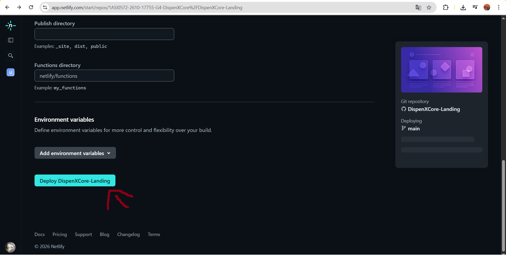
</p>

<br>

**Paso 8.** Una vez finalizado el despliegue, ingresamos al enlace generado por Netlify.

<p align="center">
  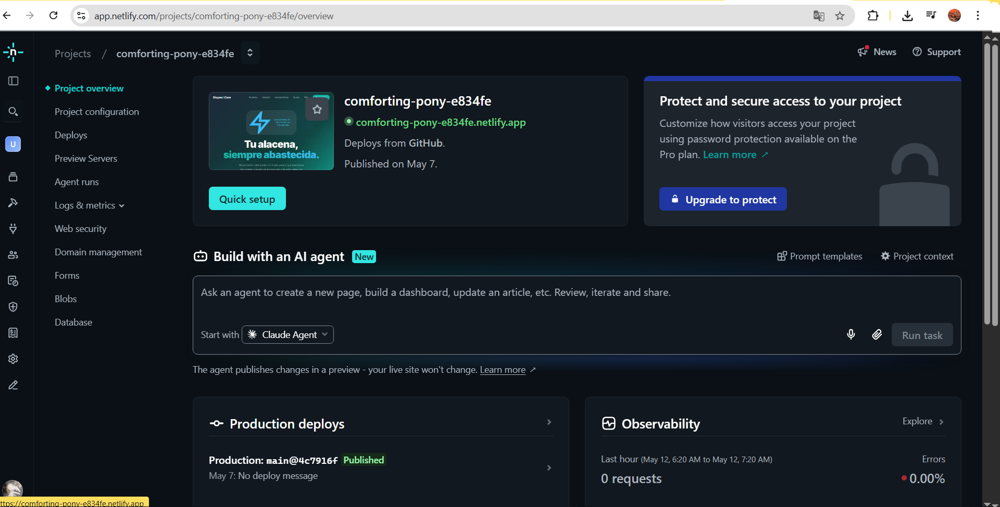
</p>

<br>

**Paso 9.** Verificamos el funcionamiento correcto de la landing page publicada.

<p align="center">
  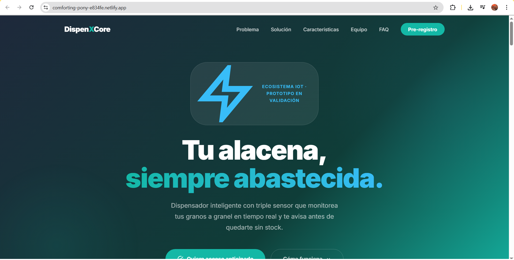
</p>

<br>

##### Enlace del Landing Page

🔗 **[https://comforting-pony-e834fe.netlify.app/](https://comforting-pony-e834fe.netlify.app/)**

<br>

**Paso 1.** Iniciar la creación del proyecto.

<p align="center">
  
</p>

<br>

**Paso 2.** Autorizar y seleccionar la organización

<p align="center">
  
</p>

<br>

**Paso 3.** Configurar el acceso a los repositorios

<p align="center">
  
</p>

<p align="center">
  
</p>

<br>

**Paso 4.** Configurar parámetros de despliegue

<p align="center">
  
</p>

<br>

**Paso 5.** Verificación final
<p align="center">
  
</p>

##### Enlace del Web Applicationm

🔗 **[https://dispenxcore.netlify.app/](https://dispenxcore.netlify.app/)**
<br>

<br>

<br>

### 6.2. Landing Page & Mobile Application Implementation

En esta sección se describe la implementación técnica de la Landing Page y de las aplicaciones móviles, incluyendo las herramientas, tecnologías y la metodología ágil aplicada mediante sprints en cada entrega del producto.

<br>

#### 6.2.1. Sprint 1

Este apartado presenta los resultados del **Sprint #1**, correspondiente a la primera entrega del proyecto. Se incluyen los avances organizativos, la asignación del trabajo y los entregables desarrollados: una landing page funcional, el avance del Web Service y una versión inicial de la Mobile Application.

<br>

##### 6.2.1.1. Sprint Planning 1

Seguidamente, se expone la planificación del Sprint 1, en la que se establecieron los objetivos iniciales, se priorizaron las tareas del backlog y se definieron las responsabilidades del equipo para este primer ciclo de desarrollo.

<table>
  <tr>
    <th>Sprint #</th>
    <th>Sprint 1</th>
  </tr>
  <tr>
    <td colspan="2" style="font-weight: bold;">Contexto de Planificación del Sprint</td>
  </tr>
  <tr>
    <td style="font-weight: bold;">Fecha</td>
    <td>08/05/2026</td>
  </tr>
  <tr>
    <td style="font-weight: bold;">Hora</td>
    <td>22:38 horas (GMT-5)</td>
  </tr>
  <tr>
    <td style="font-weight: bold;">Lugar</td>
    <td>Reunión virtual (Discord)</td>
  </tr>
  <tr>
    <td style="font-weight: bold;">Elaborado por</td>
    <td>Bastidas Bastidas, Diego Martin</td>
  </tr>
  <tr>
    <td style="font-weight: bold;">Participantes</td>
    <td>
      Bastidas Bastidas, Diego Martin<br>
      Cardenas Minaya, Ricardo Fernando<br>
      Dominguez Vargas, Rafael Alexander<br>
      Escobar Palomino, Sebastian Matias<br>
      Muñiz Huayanca, Percy Alonso
    </td>
  </tr>
  <tr>
    <td style="font-weight: bold;">Resumen de la Sprint Review 1</td>
    <td>Al tratarse del primer sprint de desarrollo, no existe un resumen de revisión anterior.</td>
  </tr>
  <tr>
    <td style="font-weight: bold;">Resumen de la Retrospectiva del Sprint 1</td>
    <td>Como este es el sprint inicial, todavía no se han detectado oportunidades de mejora concretas en el proceso.</td>
  </tr>
  <tr>
    <td colspan="2" style="font-weight: bold;">Objetivo del Sprint e Historias de Usuario</td>
  </tr>
  <tr>
    <td style="font-weight: bold;">Objetivo del Sprint 1</td>
    <td>Buscamos desarrollar una landing page que comunique de forma visual y comprensible las funcionalidades y beneficios de DispenXCore, generando en los visitantes una percepción inicial sólida sobre la plataforma y su propuesta de valor. Esta página facilitará la exploración de sus secciones para que los usuarios entiendan cómo nuestra solución vincula eficazmente la gestión inteligente de suministros con sus hogares. Además, se pondrá en valor la app web por su uso práctico y accesible, permitiendo la interacción con la plataforma desde cualquier ubicación. Validaremos este enfoque analizando la navegación de los visitantes en la landing page y su uso de la integración con la app web.</td>
  </tr>
  <tr>
    <td style="font-weight: bold;">Velocidad del Sprint 1</td>
    <td>20</td>
  </tr>
  <tr>
    <td style="font-weight: bold;">Total de Story Points</td>
    <td>20</td>
  </tr>
</table>

<br>

##### 6.2.1.2. Sprint Backlog 1

En el primer sprint, el equipo enfocó su trabajo en crear una landing page que fuera tanto funcional como atractiva, asignando las tareas en el tablero de Sprint según las habilidades de cada miembro.

| ID    | Title                          | Description                                                                                                                                                | Estimation (Hours) | Assigned To                     | Status |
| ----- | ------------------------------ | ---------------------------------------------------------------------------------------------------------------------------------------------------------- | ------------------ | ------------------------------- | ------ |
| LPS01 | Navigation                     | Implementación de la barra de navegación con enlaces a las secciones "¿Cómo funciona?", "Casos de éxito", "Planes" y "Contactos".                          | 4                  | Bastidas Bastidas, Diego Martín | Done   |
| LPS02 | Hero Section                   | Implementación de la sección "Hero Section", diseñada para captar la atención de los usuarios y presentar brevemente la aplicación.                        | 2                  | Bastidas Bastidas, Diego Martín | Done   |
| LPS03 | About the Product              | Desarrollo de la sección "About the Product", donde se describen brevemente el producto y sus principales beneficios.                                      | 2                  | Bastidas Bastidas, Diego Martín | Done   |
| LPS04 | Services and Features          | Desarrollo de la sección "Services and Features", donde se muestran las funcionalidades clave de DispenXCore.                                              | 3                  | Bastidas Bastidas, Diego Martín | Done   |
| LPS05 | Testimonials                   | Desarrollo de la sección "Testimonials", donde se presentan los comentarios y experiencias de usuarios que han utilizado la aplicación.                    | 3                  | Bastidas Bastidas, Diego Martín | Done   |
| LPS06 | Contact                        | Desarrollo de la sección "Contact", donde se detalla la forma en que los usuarios pueden comunicarse con el equipo detrás de **DispenXCore**.              | 2                  | Bastidas Bastidas, Diego Martín | Done   |
| LPS07 | Footer                         | Desarrollo de la sección "Footer", que incluye enlaces de navegación, redes sociales del equipo y accesos rápidos a las distintas secciones del sitio web. | 2                  | Bastidas Bastidas, Diego Martín | Done   |

<br>

##### 6.2.1.3. Development Evidence for Sprint Review

En esta sección se presenta la Evidencia de Desarrollo completada durante el sprint, demostrando el trabajo funcional realizado y los incrementos del producto listos para ser inspeccionados y validados en la Sprint Review.

| Repository | Branch | Commit Id | Commit Message | Committed By | Committed On |
|---|---|---|---|---|---|
| 1ASI0572-2610-17755-G4-DispenXCore | main | e0722ca | Initial commit | alomsoo | May 07, 2026 |
| 1ASI0572-2610-17755-G4-DispenXCore | main | b1de01f | added message to read.me | alomsoo | May 07, 2026 |
| 1ASI0572-2610-17755-G4-DispenXCore | main | 0c9186c | feat: landing page DispenXCore | alomsoo | May 07, 2026 |
| 1ASI0572-2610-17755-G4-DispenXCore | main | 4c7916f | Merge pull request #1 from 1ASI0572-2610-17755-G4-DispenXCore/feature/landing-page | alomsoo | May 07, 2026 |
| 1ASI0572-2610-17755-G4-DispenXCore | main | 5b9d73e | feat: add support | sebasepe | May 12, 2026 |
| 1ASI0572-2610-17755-G4-DispenXCore | main | d6ab4df | feat: add settings | sebasepe | May 12, 2026 |
| 1ASI0572-2610-17755-G4-DispenXCore | main | a2482c5 | Merge pull request #2 from 1ASI0572-2610-17755-G4-DispenXCore/feature/Support-Dashboard-Settings | Radv2005 | May 12, 2026 |
| 1ASI0572-2610-17755-G4-DispenXCore | main | db582de | feat(iamUser): Add user conection and | Radv2005 | May 12, 2026 |
| 1ASI0572-2610-17755-G4-DispenXCore | main | 3072183 | Merge pull request #3 from 1ASI0572-2610-17755-G4-DispenXCore/feature/iam-user | Radv2005 | May 12, 2026 |
| 1ASI0572-2610-17755-G4-DispenXCore | main | 99e0d68 | Merge pull request #4 from 1ASI0572-2610-17755-G4-DispenXCore/develop | Radv2005 | May 12, 2026 |
| 1ASI0572-2610-17755-G4-DispenXCore | main | 858d82e | feat(iamUser): Add json-server dependency and update db.json structure | Radv2005 | May 12, 2026 |
| 1ASI0572-2610-17755-G4-DispenXCore | main | 2f2b504 | Merge pull request #5 from 1ASI0572-2610-17755-G4-DispenXCore/feature/iam-user | Radv2005 | May 12, 2026 |
| 1ASI0572-2610-17755-G4-DispenXCore | main | 4237f05 | Merge pull request #6 from 1ASI0572-2610-17755-G4-DispenXCore/develop | Radv2005 | May 12, 2026 |
| 1ASI0572-2610-17755-G4-DispenXCore | main | 806d0c0 | feat(iamUser): Update environment configurations and budget limits | Radv2005 | May 12, 2026 |
| 1ASI0572-2610-17755-G4-DispenXCore | main | 9f711c5 | Merge pull request #7 from 1ASI0572-2610-17755-G4-DispenXCore/feature/iam-user | Radv2005 | May 12, 2026 |
| 1ASI0572-2610-17755-G4-DispenXCore | main | 9d6ef65 | Merge pull request #8 from 1ASI0572-2610-17755-G4-DispenXCore/develop | Radv2005 | May 12, 2026 |
| 1ASI0572-2610-17755-G4-DispenXCore | main | eeef321 | feat(iamUser): Add package.json with json-server configuration | Radv2005 | May 12, 2026 |
| 1ASI0572-2610-17755-G4-DispenXCore | main | 30be5d6 | Merge pull request #9 from 1ASI0572-2610-17755-G4-DispenXCore/feature/iam-user | Radv2005 | May 12, 2026 |
| 1ASI0572-2610-17755-G4-DispenXCore | main | 43557e4 | Merge pull request #10 from 1ASI0572-2610-17755-G4-DispenXCore/develop | Radv2005 | May 12, 2026 |
| 1ASI0572-2610-17755-G4-DispenXCore | main | c7ba0e1 | feat(iamUser): Update supply types to uppercase and modify db.json structure | Radv2005 | May 12, 2026 |
| 1ASI0572-2610-17755-G4-DispenXCore | main | 63fabe7 | feat(iamUser): Refactor components and implement NotFound and Support pages | Radv2005 | May 12, 2026 |
| 1ASI0572-2610-17755-G4-DispenXCore | main | 996e9a5 | Merge pull request #11 from 1ASI0572-2610-17755-G4-DispenXCore/feature/iam-user | Radv2005 | May 12, 2026 |
| 1ASI0572-2610-17755-G4-DispenXCore | main | fa6ee40 | Merge pull request #12 from 1ASI0572-2610-17755-G4-DispenXCore/develop | Radv2005 | May 12, 2026 |
|

<br>

##### 6.2.1.4. Testing Suite Evidence for Sprint Review

En este primer Sprint, veremos los archivos `.feature` relacionados a los user tasks que hemos desarrollado, subidos en el repositorio.

<table>
  <thead>
    <tr>
      <th>&nbsp;&nbsp;&nbsp;<br>Repository&nbsp;&nbsp;&nbsp;</th>
      <th>&nbsp;&nbsp;&nbsp;<br>Branch&nbsp;&nbsp;&nbsp;</th>
      <th>&nbsp;&nbsp;&nbsp;<br>Commit ID&nbsp;&nbsp;&nbsp;</th>
      <th>&nbsp;&nbsp;&nbsp;<br>Commit<br>&nbsp;&nbsp;&nbsp;<br>Message&nbsp;&nbsp;&nbsp;</th>
      <th>&nbsp;&nbsp;&nbsp;<br>Commit<br>&nbsp;&nbsp;&nbsp;<br>Message Body&nbsp;&nbsp;&nbsp;</th>
      <th>&nbsp;&nbsp;&nbsp;<br>Committed on&nbsp;&nbsp;&nbsp;(Date)&nbsp;&nbsp;&nbsp;</th>
    </tr>
  </thead>
  <tbody>
    <tr>
      <td rowspan="7">
        <a href="https://github.com/1ASI0572-2610-17755-G4-DispenXCore/DispenXCore--Features" target="_blank" rel="noopener noreferrer">
          https://github.com/1ASI0572-2610-17755-G4-DispenXCore/DispenXCore--Features
        </a>
      </td>
      <td>&nbsp;&nbsp;&nbsp;<br>main&nbsp;&nbsp;&nbsp;</td>
      <td>&nbsp;&nbsp;&nbsp;<br>d8b5cca</td>
      <td>&nbsp;&nbsp;&nbsp;<br>feat: add epic story 05</td>
      <td>&nbsp;&nbsp;&nbsp;<br>Add epic story 05</td>
      <td>&nbsp;&nbsp;&nbsp;<br>13/05/2026</td>
    </tr>
    <tr>
      <td>&nbsp;&nbsp;&nbsp;<br>main&nbsp;&nbsp;&nbsp;</td>
      <td>&nbsp;&nbsp;&nbsp;<br>673a263</td>
      <td>&nbsp;&nbsp;&nbsp;<br>feat: add epic story 04</td>
      <td>&nbsp;&nbsp;&nbsp;<br>Add epic story 04</td>
      <td>&nbsp;&nbsp;&nbsp;<br>13/05/2026</td>
    </tr>
    <tr>
      <td>&nbsp;&nbsp;&nbsp;<br>main&nbsp;&nbsp;&nbsp;</td>
      <td>&nbsp;&nbsp;&nbsp;<br>c71ee8d</td>
      <td>&nbsp;&nbsp;&nbsp;<br>feat: add epic story 03</td>
      <td>&nbsp;&nbsp;&nbsp;<br>Add epic story 03</td>
      <td>&nbsp;&nbsp;&nbsp;<br>13/05/2026</td>
    </tr>
    <tr>
      <td>&nbsp;&nbsp;&nbsp;<br>main&nbsp;&nbsp;&nbsp;</td>
      <td>&nbsp;&nbsp;&nbsp;<br>893bf09</td>
      <td>&nbsp;&nbsp;&nbsp;<br>feat: add epic story 02</td>
      <td>&nbsp;&nbsp;&nbsp;<br>Add epic story 02</td>
      <td>&nbsp;&nbsp;&nbsp;<br>13/05/2026</td>
    </tr>
    <tr>
      <td>&nbsp;&nbsp;&nbsp;<br>main&nbsp;&nbsp;&nbsp;</td>
      <td>&nbsp;&nbsp;&nbsp;<br>cfd73e5</td>
      <td>&nbsp;&nbsp;&nbsp;<br>feat: add epic story 01</td>
      <td>&nbsp;&nbsp;&nbsp;<br>Add epic story 01</td>
      <td>&nbsp;&nbsp;&nbsp;<br>13/05/2026</td>
    </tr>

  </tbody>
</table>


<br>

##### 6.2.1.5. Execution Evidence for Sprint Review

Esta sección expone la Evidencia de Ejecución del sprint, donde se aprecia el producto operativo o el incremento de valor implementado, preparado para su revisión y validación en la Sprint Review.

<br>

###### Landing Page

A continuación, se presentan las evidencias de la implementación de la landing page desarrollada en HTML, CSS y JS con la biblioteca Bootstrap.

**LPS 01 — Hero Section**

<p align="center">
  
</p>

<br>

**LPS 02 — Problema**

<p align="center">
  
</p>

<br>

**LPS 03 — Solución al problema**

<p align="center">
  
</p>

<br>

**LPS 04 — Características**

<p align="center">
  
</p>

<br>

**LPS 05 — Para quien es?**

<p align="center">
  
</p>

<br>

**LPS 07 — Nuestro Equipo**

<p align="center">
  
</p>

<br>

**LPS 08 — Preguntas Frecuentes**

<p align="center">
  
</p>

<br>

**LPS 09 — Contactos**

<p align="center">
  
</p>

<br>

###### Web Application
**WA 01 — Sign In**
<p align="center">
  
</p>

**WA 02 — Sign Up**
<p align="center">
  
</p>

**WA 03 — Dashboard**
<p align="center">
  
</p>

**WA 04 — Schedule**
<p align="center">
  
</p>

**WA 05 — History**
<p align="center">
  
</p>

**WA 06 — Settings**
<p align="center">
  
</p>

**WA 07 — Support**
<p align="center">
  
</p>
<br>

##### 6.2.1.6. Services Documentation Evidence for Sprint Review

En este Sprint se logró documentar con **OpenAPI** los endpoints correspondientes a las funcionalidades implementadas. La documentación incluye detalles técnicos de los servicios consumidos por la aplicación móvil, como los verbos HTTP, parámetros de entrada y respuestas esperadas, permitiendo una mejor comprensión e integración de la app con la API.

| Endpoint                            | Acción                              | Verbo HTTP | Sintaxis de llamada                | Parámetros o Peticiones                                                                                                                              | Ejemplo de Response                                                                                                                                                                              | URL de Documentación                                     |
| ----------------------------------- | ----------------------------------- | ---------- | ---------------------------------- | ---------------------------------------------------------------------------------------------------------------------------------------------------- | ------------------------------------------------------------------------------------------------------------------------------------------------------------------------------------------------ | -------------------------------------------------------- |
| /api/auth/login                     | Autenticación                       | POST       | api/auth/login                     | `{"email": "string", "password": "string"}`                                                                                                          | `{"accessToken": "string", "refreshToken": "string"}`                                                                                                                                            | http://localhost:8080/api/auth/login                     |
| /api/auth/register                  | Registro de usuario                 | POST       | api/auth/register                  | `{"email": "string", "firstName": "string", "lastName": "string", "password": "string"}`                                                             | `{"userId": "string", "message": "Usuario registrado exitosamente"}`                                                                                                                             | http://localhost:8080/api/auth/register                  |
| /api/v1/dispensers                  | Registrar dispensador               | POST       | api/v1/dispensers                  | `{"name": "string", "userId": "string", "grainType": "string", "maxCapacityG": "float"}`                                                             | `{"dispenserId": "string", "message": "Dispensador registrado"}`                                                                                                                                 | http://localhost:8080/api/v1/dispensers                  |
| /api/v1/dispensers/{id}             | Actualizar dispensador              | PUT        | api/v1/dispensers/{id}             | `{"name": "string", "grainType": "string", "maxCapacityG": "float"}`                                                                                 | `{"dispenserId": "string", "message": "Dispensador actualizado"}`                                                                                                                                | http://localhost:8080/api/v1/dispensers/{id}             |
| /api/v1/dispensers/{id}             | Obtener dispensador por ID          | GET        | api/v1/dispensers/{id}             | none                                                                                                                                                 | `{"id": "string", "name": "string", "grainType": "string", "status": "string", "maxCapacityG": "float"}`                                                                                         | http://localhost:8080/api/v1/dispensers/{id}             |
| /api/v1/dispensers                  | Listar dispensadores por usuario    | GET        | api/v1/dispensers                  | query params: `?userId=string`                                                                                                                       | `[{"id": "string", "name": "string", "grainType": "string", "status": "string"}]`                                                                                                                | http://localhost:8080/api/v1/dispensers                  |
| /api/v1/telemetry                   | Recibir lectura de sensores         | POST       | api/v1/telemetry                   | `{"dispenserId": "string", "weightGrams": "float", "levelPercentage": "float", "flowRateGs": "float", "rawUltrasonicCm": "float"}`                   | `{"readingId": "string", "message": "Lectura registrada"}`                                                                                                                                       | http://localhost:8080/api/v1/telemetry                   |
| /api/v1/stock-readings              | Obtener historial de stock          | GET        | api/v1/stock-readings              | query params: `?dispenserId=string`                                                                                                                  | `[{"id": "string", "weightGrams": "float", "levelPercentage": "float", "recordedAt": "datetime"}]`                                                                                               | http://localhost:8080/api/v1/stock-readings              |
| /api/v1/alert-configurations        | Crear configuración de alerta       | POST       | api/v1/alert-configurations        | `{"dispenserId": "string", "lowThresholdPercentage": "float", "criticalThresholdPercentage": "float"}`                                               | `{"configId": "string", "message": "Configuración creada"}`                                                                                                                                      | http://localhost:8080/api/v1/alert-configurations        |
| /api/v1/alert-configurations/{id}   | Actualizar umbrales de alerta       | PUT        | api/v1/alert-configurations/{id}   | `{"lowThresholdPercentage": "float", "criticalThresholdPercentage": "float", "isEnabled": "boolean"}`                                                | `{"message": "Configuración actualizada"}`                                                                                                                                                       | http://localhost:8080/api/v1/alert-configurations/{id}   |
| /api/v1/notifications               | Listar notificaciones del usuario   | GET        | api/v1/notifications               | query params: `?userId=string`                                                                                                                       | `[{"id": "string", "type": "string", "title": "string", "messageBody": "string", "isRead": "boolean"}]`                                                                                          | http://localhost:8080/api/v1/notifications               |
| /api/v1/notifications/{id}/read     | Marcar notificación como leída      | PUT        | api/v1/notifications/{id}/read     | none                                                                                                                                                 | `{"message": "Notificación marcada como leída"}`                                                                                                                                                 | http://localhost:8080/api/v1/notifications/{id}/read     |
| /api/v1/caregiver-subscriptions     | Vincular cuidador a familiar        | POST       | api/v1/caregiver-subscriptions     | `{"caregiverId": "string", "monitoredUserId": "string", "alertConfigId": "string"}`                                                                  | `{"subscriptionId": "string", "message": "Suscripción creada"}`                                                                                                                                  | http://localhost:8080/api/v1/caregiver-subscriptions     |
| /api/v1/caregiver-subscriptions/{id}| Desactivar suscripción de cuidador  | DELETE     | api/v1/caregiver-subscriptions/{id}| none                                                                                                                                                 | `{"message": "Suscripción desactivada"}`                                                                                                                                                         | http://localhost:8080/api/v1/caregiver-subscriptions/{id}|

<br>

##### 6.2.1.7. Software Deployment Evidence for Sprint Review

En esta sección se presenta la Evidencia de Despliegue del Software, verificando que el incremento desarrollado durante el sprint ha sido implementado y se encuentra accesible en el entorno de destino para su revisión final.

<br>

###### Landing Page

A continuación, se proporcina el enlace del landing page

🔗 **Enlace:** [https://comforting-pony-e834fe.netlify.app/](https://comforting-pony-e834fe.netlify.app/)

<br>

<p align="center">
  
</p>

<br>

###### Web Application

A continuación, se proporcina el enlace de despliegue del web application  

🔗 **Enlace:** [https://dispenxcore.netlify.app/](https://dispenxcore.netlify.app/)

<br>
<p align="center">
  
</p>

<br>

##### 6.2.1.8. Team Collaboration Insights during Sprint

En esta sección se exponen las **Reflexiones sobre la Colaboración del Equipo** durante el sprint, detallando las dinámicas de trabajo y las lecciones clave identificadas para la mejora continua del proceso.

| Alumno                              | Actividad                                     |
| ----------------------------------- | --------------------------------------------- |
| Bastidas Bastidas, Diego Martin     | Figma Design, Backend                         |
| Cardenas Minaya, Ricardo Fernando   | Figma Design, Prototyping, Frontend           |
| Dominguez Vargas, Rafael Alexander  | Figma Design, Frontend                        |
| Escobar Palomino, Sebastian Matias  | Figma Design, Frontend                        |
| Muñiz Huayanca, Percy Alonso        | Landing Page Deployment, Figma Design, Backend|

<br>

###### Evidencias de colaboración — Report

<p align="center">
  
</p>

<p align="center">
  
</p>


<br>

###### Evidencias de colaboración — Landing Page

<p align="center">
  
</p>

<p align="center">
  
</p>

<br>

###### Evidencias de colaboración — Web Application

<p align="center">
  
</p>

<p align="center">
  
</p>

<br>

#### 6.2.2. Sprint 2
La siguiente sección detalla los resultados del Sprint #2 del proyecto DispenXCore. En este incremento se logró la integración del backend con la aplicación web y la aplicación móvil, permitiendo la conexión completa de los servicios del sistema. Asimismo, se desarrolló el Edge , y se realizaron ajustes y mejoras en la simulación del entorno Wokwi, fortaleciendo la validación del comportamiento del dispositivo IoT dentro del ecosistema del proyecto.

##### 6.2.2.1. Sprint Planning 2
<table>
  <tr>
    <th>Sprint #</th>
    <th>Sprint 2</th>
  </tr>
  <tr>
    <td colspan="2" style="font-weight: bold;">Contexto de Planificación del Sprint</td>
  </tr>
  <tr>
    <td style="font-weight: bold;">Fecha</td>
    <td>05/06/2026</td>
  </tr>
  <tr>
    <td style="font-weight: bold;">Hora</td>
    <td>22:00 horas (GMT-5)</td>
  </tr>
  <tr>
    <td style="font-weight: bold;">Lugar</td>
    <td>Reunión virtual (Discord)</td>
  </tr>
  <tr>
    <td style="font-weight: bold;">Elaborado por</td>
    <td>Dominguez Vargas, Rafael Alexander</td>
  </tr>
  <tr>
    <td style="font-weight: bold;">Participantes</td>
    <td>
      Bastidas Bastidas, Diego Martin<br>
      Cardenas Minaya, Ricardo Fernando<br>
      Dominguez Vargas, Rafael Alexander<br>
      Escobar Palomino, Sebastian Matias<br>
      Muñiz Huayanca, Percy Alonso
    </td>
  </tr>
  <tr>
    <td style="font-weight: bold;">Resumen de la Sprint Review 2</td>
    <td>En el sprint anterior se desarrolló la landing page del proyecto, enfocada en la presentación visual y funcional de DispenXCore, permitiendo comunicar de manera clara su propuesta de valor. Asimismo, se avanzó parcialmente en la web application, implementando estructuras base de navegación y componentes iniciales. Como parte del progreso técnico del proyecto, también se incorporó el módulo de edge computing del sistema y se realizaron pruebas en Wokwi para la simulación del entorno IoT. Adicionalmente, se logró el despliegue del backend en un entorno funcional y su correcta integración con la aplicación web, permitiendo la comunicación entre servicios y validación de endpoints principales.</td>
  </tr>
  <tr>
    <td style="font-weight: bold;">Resumen de la Retrospectiva del Sprint 2</td>
    <td> Durante este segundo sprint, el equipo logró establecer una base funcional del sistema DispenXCore, completando el desarrollo de la landing page, avances iniciales en la web application, la integración del backend desplegado y la incorporación del entorno de simulación IoT mediante Wokwi, junto con el módulo edge del sistema. 
    A nivel de proceso, se identificó que la coordinación entre los componentes frontend, backend e IoT requiere una mayor sincronización para evitar retrabajos y asegurar una integración más fluida en futuras iteraciones. Asimismo, se evidenció la necesidad de mejorar la definición temprana de interfaces y contratos de API para reducir fricciones en la integración.
    Como mejora continua, se propone reforzar la planificación técnica del sprint, establecer puntos de integración más frecuentes y validar progresivamente los módulos (frontend, backend y edge) para garantizar estabilidad en cada incremento.</td>
  </tr>
  <tr>
    <td colspan="2" style="font-weight: bold;">Objetivo del Sprint e Historias de Usuario</td>
  </tr>
  <tr>
    <td style="font-weight: bold;">Objetivo del Sprint 2</td>
    <td>El objetivo de este sprint fue implementar la base funcional y visual del sistema DispenXCore, iniciando con el desarrollo de la landing page como punto de entrada informativo del proyecto y avanzando en la construcción de la aplicación web. Asimismo, se integró el backend desplegado para habilitar la comunicación entre los distintos módulos del sistema. Como parte de la arquitectura IoT, se incorporó la simulación del entorno mediante Wokwi y el componente edge del sistema, permitiendo validar el flujo de datos entre dispositivos y la plataforma. Este sprint sienta las bases de la arquitectura completa del sistema, asegurando conectividad, despliegue y validación inicial de los servicios..</td>
  </tr>
  <tr>
    <td style="font-weight: bold;">Velocidad del Sprint 2</td>
    <td>20</td>
  </tr>
  <tr>
    <td style="font-weight: bold;">Total de Story Points</td>
    <td>20</td>
  </tr>
</table>

<br>

##### 6.2.2.2. Aspect Leaders and Collaborators

| **Team Member (Last Name, First Name)** | **GitHub Username** | **Capítulo I: Introduction** | **Capítulo II: Requirements Elicitation & Analysis** | **Capítulo III: Requirements Specification** | **Capítulo IV: Solution Software Design** | **Capítulo V: Solution UI/UX Design** | **Capítulo VI: Product Implementation, Validation & Deployment** |
|----------------------------------------|---------------------|------------------------------|------------------------------------------------------|----------------------------------------------|------------------------------------------|--------------------------------------|------------------------------------------------------------------|
| Bastidas Bastidas, Diego Martín       | ghostnotfound404    | **L**                        | C                                                    | C                                            | C                                        | C                                    | C                                                                |
| Cárdenas Minaya, Ricardo Fernando     | RicardoCardenas     | C                            | **L**                                                | C                                            | C                                        | C                                    | C                                                                |
| Domínguez Vargas, Rafael Alexander    | Radv2005            | C                            | C                                                    | **L**                                        | C                                        | C                                    | C                                                                |
| Escobar Palomino, Sebastián Matías    | sebasepe            | C                            | C                                                    | C                                            | **L**                                    | C                                    | C                                                                |
| Muñiz Huayanca, Percy Alonso          | alomsoo             | C                            | C                                                    | C                                            | C                                        | **L**                                | C                                                                |


##### 6.2.2.3. Sprint Backlog 2
En el segundo sprint, el equipo se enfocó en el desarrollo de las funcionalidades principales de la Web Application, la implementación del módulo IoT con Wokwi y el edge computing, así como la integración completa con el backend. Las tareas se distribuyeron según la especialidad de cada miembro para asegurar el cumplimiento de los objetivos del sprint.


| ID | Title | Description | Estimation (Hours) | Assigned To | Status |
| --- | --- | --- | --- | --- | --- |
| LPS01 | User Authentication Module | Implementación del registro e inicio de sesión de usuarios, con conexión al backend mediante JWT. | 5 | Bastidas Bastidas, Diego Martín | Done |
| LPS02 | Dashboard & Dispenser List | Desarrollo del panel principal que muestra el listado de dispensadores registrados y su estado actual (conectado, nivel de grano, alertas). | 4 | Dominguez Vargas, Rafael | Done |
| LPS03 | Dispenser Registration | Formulario para registrar un nuevo dispensador, incluyendo nombre, tipo de grano y capacidad máxima, conectado al endpoint del backend. | 3 | Cardenas Minaya, Ricardo | Done |
| LPS04 | Real-time Telemetry View | Implementación de la vista de telemetría en tiempo real (peso, nivel y flujo) para un dispensador específico, consumiendo datos desde el backend. | 5 | Escobar Palomino, Sebastian | Done |
| LPS05 | Alert Configuration UI | Desarrollo de la interfaz para configurar umbrales de alerta (bajo y crítico) por dispensador, conectada al endpoint de configuración. | 3 | Muñiz Huayanca, Percy | Done |
| LPS06 | Caregiver Subscription | Pantalla para vincular un cuidador a un familiar, permitiendo la gestión de notificaciones compartidas. | 3 | Bastidas Bastidas, Diego Martín | Done |
| LPS07 | IoT Simulation (Wokwi) | Implementación y configuración de la simulación del dispositivo IoT en Wokwi, generando datos de telemetría simulados para pruebas de integración. | 4 | Muñiz Huayanca, Percy | Done |
| LPS08 | Edge Module Integration | Desarrollo del componente edge para procesamiento local de datos, incluyendo lógica de alertas tempranas y comunicación con el backend. | 4 | Dominguez Vargas, Rafael | Done |
| LPS09 | Navigation & UI/UX Refinement | Mejora de la navegación entre módulos (Dashboard, Historial, Configuración, Soporte) y ajustes visuales basados en la guía de estilos. | 2 | Cardenas Minaya, Ricardo | Done |
| LPS10 | Deployment Configuration | Configuración del despliegue continuo para la Web Application y el Landing Page en Netlify, asegurando la integración con el repositorio. | 2 | Escobar Palomino, Sebastian | Done |


##### 6.2.2.4. Development Evidence for Sprint Review 
En esta sección se muestra la evidencia de desarrollo realizada durante el sprint, evidenciando el trabajo funcional implementado y los incrementos del producto que están listos para su inspección y validación en la Sprint Review.

**Web Frontend Evidence**

| Repository | Branch / Module | Commit Id | Commit Message | Committed By | Date |
|------------|----------------|------------|----------------|---------------|------|
| DispenXCore-Web-FrontEnd | develop | 3660965 | Merge pull request #16 from develop | Radv2005 | Jun 18, 2026 |
| DispenXCore-Web-FrontEnd | feature/api-integration | b44df7b | Merge pull request #15 from feature/api-integration | Radv2005 | Jun 18, 2026 |
| DispenXCore-Web-FrontEnd | feature/api-integration | 871f8e8 | feat(authentication, notifications, user): Refactor authentication flow and notifications handling | Radv2005 | Jun 18, 2026 |
| DispenXCore-Web-FrontEnd | feature/notifications-alerts | 83890ab | Merge pull request #14 notifications-alerts | Radv2005 | May 28, 2026 |
| DispenXCore-Web-FrontEnd | feature/dashboard | 977b226 | feat(dashboard): Enhance dashboard with metrics and responsive design | Radv2005 | May 28, 2026 |
| DispenXCore-Web-FrontEnd | feature/profile | f4b46b9 | feat(profile): Add profile management and password update | Radv2005 | May 28, 2026 |
| DispenXCore-Web-FrontEnd | feature/notifications | 64c0a39 | feat(notifications): Implement notifications UI and state management | Radv2005 | May 28, 2026 |
| DispenXCore-Web-FrontEnd | feature/iam-user | 63fabe7 | feat(iamUser): Refactor components and add support pages | Radv2005 | May 12, 2026 |
| DispenXCore-Web-FrontEnd | feature/iam-user | c7ba0e1 | feat(iamUser): Update DB structure and supply types | Radv2005 | May 12, 2026 |
| DispenXCore-Web-FrontEnd | feature/settings-support | d6ab4df | feat: add settings and support modules | sebasepe | May 12, 2026 |
| DispenXCore-Web-FrontEnd | feature/inventory-telemetry | 745388d | feat: Add Schedule and History pages | Radv2005 | May 11, 2026 |
| DispenXCore-Web-FrontEnd | main/init | 352dfcc | Initial commit | Radv2005 | May 7, 2026 |

**Backend Evidence**

| Repository | Branch / Module | Commit Id | Commit Message | Committed By | Date |
|------------|----------------|------------|----------------|---------------|------|
| DispenXCore-Backend | develop | 228d216 | fix: notifications error | Radv2005 | Jun 18, 2026 |
| DispenXCore-Backend | develop | 5bf5d54 | fix: HTTP error handling | Radv2005 | Jun 17, 2026 |
| DispenXCore-Backend | develop | 994ce19 | fix: EnableRetryOnFailure for MySQL (Railway) | Radv2005 | Jun 17, 2026 |
| DispenXCore-Backend | develop | 3624364 | fix: specify MySQL version instead of AutoDetect | Radv2005 | Jun 17, 2026 |
| DispenXCore-Backend | develop | cde6d69 | Add Dockerfile for Railway deployment | Radv2005 | Jun 17, 2026 |
| DispenXCore-Backend | develop | 0dd56a1 | fix: initial migration applied and database synced | Radv2005 | Jun 17, 2026 |
| DispenXCore-Backend | develop | c36e735 | update backend | Radv2005 | Jun 17, 2026 |
| DispenXCore-Backend | feature/dispenser | 07718e9 | Add or update Azure App Service build and deployment workflow config | ghostnotfound404 | Jun 14, 2026 |
| DispenXCore-Backend | feature/dispenser | 4ff7fe3 | Added post dispenser | ghostnotfound404 | Jun 14, 2026 |
| DispenXCore-Backend | feature/dispenser | 53ee032 | feat: implement domain entities and database migration for Dispensator, DispenserEvent, and Schedule management | ghostnotfound404 | Jun 14, 2026 |
| DispenXCore-Backend | feature/dispenser | e97913a | Fix backend controller | ghostnotfound404 | Jun 14, 2026 |
| DispenXCore-Backend | develop | 488d6f7 | Update: New endpoints | ghostnotfound404 | Jun 8, 2026 |
| DispenXCore-Backend | main/init | b0c3e59 | First version backend | ghostnotfound404 | May 11, 2026 |

**Mobile Frontend Evidence**
| Repository                  | Branch / Module | Commit Id | Commit Message                                                           | Committed By    | Date         |
| --------------------------- | --------------- | --------- | ------------------------------------------------------------------------ | --------------- | ------------ |
| DispenXCore-Mobile-FrontEnd | develop         | a8093fb   | feat: connect inventory and alerts to backend                            | alomsoo         | Jun 18, 2026 |
| DispenXCore-Mobile-FrontEnd | develop         | 75663cf   | feat: connect inventory and alerts-stock to backend real                 | alomsoo         | Jun 18, 2026 |
| DispenXCore-Mobile-FrontEnd | develop         | e8b93a0   | feat: connect history/dispenser-events with filters and weekly chart     | alomsoo         | Jun 18, 2026 |
| DispenXCore-Mobile-FrontEnd | develop         | f95656c   | feat: connect schedules CRUD to backend (fix supplyType & frequencyDays) | alomsoo         | Jun 18, 2026 |
| DispenXCore-Mobile-FrontEnd | develop         | 940778c   | feat: connect notifications module to backend real                       | alomsoo         | Jun 18, 2026 |
| DispenXCore-Mobile-FrontEnd | develop         | f042140   | feat: connect dispensators, device and home to backend real              | alomsoo         | Jun 18, 2026 |
| DispenXCore-Mobile-FrontEnd | develop         | 0b0f56d   | feat: edit profile fixed                                                 | alomsoo         | Jun 18, 2026 |
| DispenXCore-Mobile-FrontEnd | develop         | b571562   | feat: connect user module (profile + edit + password change)             | alomsoo         | Jun 18, 2026 |
| DispenXCore-Mobile-FrontEnd | develop         | 4f9b514   | feat: connect auth backend (login + register)                            | alomsoo         | Jun 18, 2026 |
| DispenXCore-Mobile-FrontEnd | develop         | 7f0d010   | feat: UI improvements (login, register, home)                            | alomsoo         | Jun 18, 2026 |
| DispenXCore-Mobile-FrontEnd | feature/home    | 7fb3e35   | feat: add home module                                                    | sebasepe        | Jun 13, 2026 |
| DispenXCore-Mobile-FrontEnd | feature/home    | 780d8f8   | feat: add home module (update)                                           | sebasepe        | Jun 13, 2026 |
| DispenXCore-Mobile-FrontEnd | feature/alerts  | 93be51e   | Add alerts feature and UI                                                | RicardoCardenas | Jun 3, 2026  |
| DispenXCore-Mobile-FrontEnd | main/init       | bb9a22d   | Fix clone repository URL in README.md                                    | Radv2005        | May 26, 2026 |
| DispenXCore-Mobile-FrontEnd | main/init       | ae77f58   | Initial commit                                                           | Radv2005        | May 26, 2026 |


**Edge Service Evidence**
| Repository               | Branch / Module | Commit Id | Commit Message                                                           | Committed By    | Date         |
| ------------------------ | --------------- | --------- | ------------------------------------------------------------------------ | --------------- | ------------ |
| DispenXCore-Edge-Service | develop         | 896c88c   | Refactor move requirements.txt to project root                           | RicardoCardenas | Jun 17, 2026 |
| DispenXCore-Edge-Service | develop         | b894af    | Add or update the Azure App Service build and deployment workflow config | RicardoCardenas | Jun 17, 2026 |
| DispenXCore-Edge-Service | develop         | 2796899   | feat: backend async client notifications                                 | RicardoCardenas | Jun 17, 2026 |
| DispenXCore-Edge-Service | main/init       | ef1e2c7   | Add DispenX Edge service base setup                                      | RicardoCardenas | Jun 13, 2026 |


##### 6.2.2.5. Testing Suite Evidence for Sprint Review
Durante este Sprint, se presentan los commits asociados a la implementación de las épicas del sistema DispenXCore. Estas evidencias reflejan el avance incremental del desarrollo, donde se incorporaron las historias de usuario correspondientes a cada épica funcional del sistema.

| Repository | Branch | Commit ID | Commit Message | Commit Message Body | Committed on (Date) |
|------------|--------|------------|-----------------|---------------------|----------------------|
| https://github.com/1ASI0572-2610-17755-G4-DispenXCore/DispenXCore--Features | main | d8b5cca | feat: add epic story 05 | Implementación de la épica 05 del sistema DispenXCore. | 13/05/2026 |
| https://github.com/1ASI0572-2610-17755-G4-DispenXCore/DispenXCore--Features | main | 673a263 | feat: add epic story 04 | Implementación de la épica 04 del sistema DispenXCore. | 13/05/2026 |
| https://github.com/1ASI0572-2610-17755-G4-DispenXCore/DispenXCore--Features | main | c71ee8d | feat: add epic story 03 | Implementación de la épica 03 del sistema DispenXCore. | 13/05/2026 |
| https://github.com/1ASI0572-2610-17755-G4-DispenXCore/DispenXCore--Features | main | 893bf09 | feat: add epic story 02 | Implementación de la épica 02 del sistema DispenXCore. | 13/05/2026 |
| https://github.com/1ASI0572-2610-17755-G4-DispenXCore/DispenXCore--Features | main | cfd73e5 | feat: add epic story 01 | Implementación de la épica 01 del sistema DispenXCore. | 13/05/2026 |

##### 6.2.2.6. Execution Evidence for Sprint Review
En esta sección se presenta la Evidencia de Ejecución del sprint, la cual muestra el incremento funcional desarrollado de la web application , backend y  aplicación móvil de DispenXCore, listo para su validación durante la Sprint Review.

### **WEB APPLICATION – DISPENXCORE**

A continuación, se presentan las evidencias de ejecución del sistema web DispenXCore, el cual permite la gestión de usuarios, dispositivos IoT, programación de dispensación, monitoreo de inventario y soporte al usuario.

---

#### **WEB 01: Login del sistema**

Se muestra la pantalla de autenticación donde el usuario puede iniciar sesión en la plataforma DispenXCore, con soporte multilenguaje (ES/EN) y acceso seguro al sistema.

<div align="center">

</div>

---

#### **WEB 02: Registro de usuario**

Interfaz de creación de cuenta donde el usuario puede registrarse ingresando datos personales como nombre, apellido, correo y contraseña, junto con aceptación de términos y condiciones.

<div align="center">

</div>

---

#### **WEB 03: Dashboard principal**

Se presenta el panel principal del sistema, donde se visualiza el estado general del dispositivo, nivel de inventario, dispensación automática, métricas de consumo y resumen operativo.

<div align="center">

</div>

---

#### **WEB 04: Programación de horarios**

Módulo que permite configurar rutinas automáticas de dispensación, definiendo cantidades, horarios y días de ejecución para cada programación.

<div align="center">

</div>

---

#### **WEB 05: Historial de dispensación**

Se muestra el registro de eventos de consumo, incluyendo análisis de tendencia, cantidad dispensada por día y métricas semanales del sistema.

<div align="center">

</div>

---

#### **WEB 06: Configuración del sistema**

Sección donde el usuario puede gestionar preferencias del dispositivo, notificaciones, conexión WiFi, protocolo MQTT, seguridad y ajustes de cuenta.

<div align="center">

</div>

---

#### **WEB 07: Centro de ayuda**

Pantalla de soporte donde el usuario puede consultar preguntas frecuentes, acceder a chat en vivo o solicitar soporte por correo o teléfono.

<div align="center">

</div>

---
### **BACKEND – DISPENXCORE API**

A continuación, se presentan las evidencias de ejecución del backend de DispenXCore, documentado mediante Swagger (OpenAPI 3.0), el cual expone los servicios REST utilizados por la aplicación web y móvil para la gestión del sistema IoT.

---

#### **BE 01: Documentación general de la API (Swagger – DispenX API v1)**

Se muestra la interfaz principal de Swagger donde se centraliza la documentación de la API, permitiendo visualizar y ejecutar los endpoints del sistema DispenXCore bajo la versión v1.

<div align="center">

</div>

---

#### **BE 02: Módulos principales del sistema**

Se evidencian los principales módulos funcionales del backend, incluyendo autenticación, dispositivos, dispensadores, eventos, firmware, inventario, notificaciones, programación de horarios y usuarios, todos estructurados bajo arquitectura REST.

<div align="center">

</div>

---

#### **BE 03: Definición de esquemas y modelos de datos**

Se presenta la sección de schemas donde se definen los modelos utilizados por la API, tales como LoginRequest, RegisterRequest, ScheduleRequest, DeviceUpdateDto y otros DTOs necesarios para la comunicación entre cliente y servidor.

<div align="center">

</div>

---

### **MOBILE APPLICATION – DISPENXCORE**

A continuación, se evidencian las principales funcionalidades de la aplicación móvil del sistema DispenXCore, orientada al monitoreo de inventario, control de dispositivos IoT, historial de consumo, programación de dispensación y configuración del sistema.

---

#### **MOB 01: Login y registro de usuario**

Se muestra la interfaz de autenticación del sistema, donde el usuario puede iniciar sesión o registrarse en la plataforma DispenXCore, incluyendo soporte para credenciales seguras.

<div align="center">

</div>

<div align="center">

</div>
---

#### **MOB 02: Dashboard principal (Home)**

Pantalla principal donde el usuario visualiza el estado general del inventario, nivel de stock, dispositivos conectados y accesos rápidos a la función de dispensación automática.

<div align="center">

</div>

---

#### **MOB 03: Gestión de dispositivo IoT**

Se observa la sección de dispositivos conectados, donde el usuario puede visualizar el estado del dispensador, modelo del equipo, ubicación y realizar dispensación manual.

<div align="center">

</div>

---

#### **MOB 04: Historial de consumo**

Pantalla donde se muestra el registro de dispensaciones realizadas, diferenciando entre consumo manual y programado, junto con métricas de cantidad y análisis de tendencia.

<div align="center">

</div>

---

#### **MOB 05: Programación de horarios**

Módulo donde el usuario configura dispensaciones automáticas, definiendo cantidad, tipo de insumo y días de ejecución.

<div align="center">

</div>

---

#### **MOB 06: Configuración del sistema**

Sección de configuración donde el usuario gestiona preferencias del sistema, incluyendo notificaciones de stock bajo, conexión Wi-Fi, protocolo MQTT y ajustes de cuenta.

<div align="center">

</div>

---
### **WOKWI – DISPENXCORE**

A continuación, se evidencian el prototipo de hardware simulado en Wokwi correspondiente al sistema DispenXCore, donde se integra el ESP32 con sensores y actuadores para el monitoreo y control del dispositivo inteligente de dispensación.

---

#### **WOK 01: Prototipo**

Se muestra el prototipo en wokwi

<div align="center">

</div>

---

##### 6.2.2.7. Services Documentation Evidence for Sprint Review

En este Sprint se logró documentar mediante OpenAPI (Swagger) los endpoints correspondientes a las funcionalidades implementadas en el sistema DispenXCore. Esta documentación detalla los servicios consumidos por la aplicación web y móvil, incluyendo los verbos HTTP utilizados, los parámetros de entrada requeridos y las respuestas esperadas por cada operación. Esto facilita la comprensión del funcionamiento de la API y mejora la integración entre el backend y los distintos clientes del ecosistema IoT.

**Documentación de Endpoints Backend**
| Método | Endpoint | Descripción | ¿Requiere Auth? |
|--------|----------|-------------|------------------|
| `POST` | `/api/v1/auth/register` | Registra un nuevo usuario | No |
| `POST` | `/api/v1/auth/login` | Inicia sesión y devuelve token JWT | No |
| `POST` | `/api/v1/auth/logout` | Cierra sesión (simbólico) | Sí |
| `GET` | `/api/v1/users/{id}` | Obtiene perfil de usuario por ID | Sí |
| `PUT` | `/api/v1/users/{id}` | Actualiza nombre, apellido y foto del usuario | Sí |
| `PATCH` | `/api/v1/users/{id}/password` | Cambia la contraseña del usuario | Sí |
| `GET` | `/api/v1/inventario/estado` | Obtiene el estado de todos los contenedores (stock) | Sí |
| `POST` | `/api/v1/inventario/medicion` | Registra una nueva medición (peso, nivel, flujo) | Sí |
| `GET` | `/api/v1/alertas-stock/{contenedorId}` | Lista las alertas de un contenedor | Sí |
| `POST` | `/api/v1/alertas-stock/evaluar` | Evalúa umbrales y envía push si aplica | Sí |
| `GET` | `/api/v1/dispensators` | Lista todos los dispensadores | Sí |
| `GET` | `/api/v1/dispensators/{id}` | Obtiene el estado dinámico de un dispensador (incluye `nextDispenseAt`) | Sí |
| `POST` | `/api/v1/dispensators` | Crea un nuevo dispensador y su estado inicial | Sí |
| `GET` | `/api/v1/schedules` | Lista horarios activos de un dispensador (query `dispensatorId`) | Sí |
| `POST` | `/api/v1/schedules` | Crea un nuevo horario de dispensación | Sí |
| `GET` | `/api/v1/schedules/{id}` | Obtiene un horario específico | Sí |
| `PUT` | `/api/v1/schedules/{id}` | Actualiza un horario existente | Sí |
| `DELETE` | `/api/v1/schedules/{id}` | Elimina un horario | Sí |
| `PATCH` | `/api/v1/schedules/{id}/toggle` | Activa/desactiva un horario | Sí |
| `GET` | `/api/v1/dispenser-events` | Lista eventos de dispensación (filtros: dispensatorId, from, to, supplyType) | Sí |
| `POST` | `/api/v1/dispenser-events` | Registra un nuevo evento de dispensación | Sí |
| `GET` | `/api/v1/device` | Obtiene información del dispositivo IoT | Sí |
| `PATCH` | `/api/v1/device` | Actualiza nombre y ubicación del dispositivo | Sí |
| `POST` | `/api/v1/device/ping` | Registra un latido (actualiza `lastSeen`) | Sí |
| `GET` | `/api/v1/firmware` | Lista todas las versiones de firmware | Sí |
| `GET` | `/api/v1/firmware/latest` | Obtiene la versión de firmware más reciente | Sí |
| `POST` | `/api/v1/firmware/{id}/install` | Inicia la instalación de un firmware (simulado) | Sí |
| `GET` | `/api/v1/notifications` | Obtiene notificaciones de un usuario (query `userId`) | Sí |
| `PATCH` | `/api/v1/notifications/{id}/read` | Marca una notificación como leída | Sí |
| `PATCH` | `/api/v1/notifications/read-all` | Marca todas las notificaciones de un usuario como leídas (`userId`) | Sí |


##### 6.2.2.8. Software Deployment Evidence for Sprint Review
<br>
En esta sección se presenta la Evidencia de Despliegue del Software del sistema DispenXCore, detallando de forma secuencial cada etapa del proceso de despliegue en la plataforma Railway, así como la configuración de la base de datos y la validación del backend mediante Swagger.<br><br>

<br>
En esta sección se presenta la Evidencia de Despliegue del Software del sistema DispenXCore, mostrando el proceso completo de configuración y despliegue en la plataforma Railway, así como la validación del backend y la base de datos en entorno cloud.<br><br>

---

### **1. Creación del proyecto en Railway**

Se observa la pantalla inicial de Railway donde se crea un nuevo proyecto. En esta etapa se selecciona el punto de inicio para el despliegue del sistema DispenXCore, habilitando la infraestructura cloud donde se alojarán los servicios del backend.


---

### **2. Selección del repositorio desde GitHub**

Se muestra la conexión del proyecto Railway con el repositorio de GitHub del backend de DispenXCore.

Esta integración permite habilitar el despliegue automático (CI/CD), asegurando que cada actualización del código se refleje en el entorno de producción.


---

### **3. Configuración del proyecto y servicios asociados**

En esta etapa se visualiza la configuración del proyecto en Railway, incluyendo la selección del repositorio backend y la preparación del entorno de despliegue.

Aquí se define la estructura inicial del servicio que será desplegado.


---

### **4. Configuración del backend (Variables y despliegue)**

Se observa la configuración del backend del sistema DispenXCore, donde se definen variables de entorno y parámetros de ejecución.

Esto permite la correcta comunicación entre el backend y la base de datos MySQL.


---

### **5. Configuración de MySQL (recursos del sistema)**

Se evidencia la configuración del servicio MySQL dentro de Railway, donde se asignan recursos como CPU y memoria.

Esta configuración garantiza el rendimiento adecuado del sistema en producción.


---

### **6. Configuración avanzada del servicio MySQL**

Se muestra la configuración detallada del motor MySQL, incluyendo límites de recursos, parámetros de despliegue y opciones del contenedor.

Esto asegura estabilidad en el almacenamiento de datos del sistema.


---

### **7. Estado del despliegue del backend (Active)**

Se observa el estado del backend desplegado en Railway, el cual se encuentra en estado **Active**, indicando que el servicio está correctamente funcionando.

También se muestra la URL pública del backend, permitiendo el acceso externo a la API.


---

### **8. Configuración de base de datos (MySQL Tables)**

Se evidencia la estructura de la base de datos del sistema DispenXCore, donde se visualizan las principales tablas del sistema como usuarios, dispositivos, dispensadores, notificaciones y alertas.

Esto confirma el correcto despliegue del modelo de datos.


---

### **9. Validación del backend mediante Swagger**

Finalmente, se valida el despliegue del backend mediante Swagger UI, donde se exponen los endpoints del sistema DispenXCore.

Se observan módulos como autenticación, dispositivos, alertas y dispensadores, confirmando que la API está completamente funcional y lista para consumo.


---

##### 6.2.2.9. Team Collaboration Insights during Sprint
En esta sección se presentan las reflexiones sobre la colaboración del equipo durante el sprint, describiendo las formas de trabajo adoptadas y las principales lecciones aprendidas que contribuyen a la mejora continua del proceso.

**WEB APPLICATION**


**BACKEND**


**MOBILE FRONTEND**


#### 6.2.3. Sprint 3
La siguiente sección detalla los resultados del Sprint #3 del proyecto DispenXCore. En este incremento se priorizó el cierre de la aplicación móvil, la implementación del dispositivo IoT físico y el avance de una parte del backend necesaria para consolidar la integración del sistema. Asimismo, se realizaron ajustes de validación sobre la comunicación entre la app móvil, el backend y el dispositivo, fortaleciendo la estabilidad del flujo de datos dentro del ecosistema del proyecto.

#### 6.2.3.1. Sprint Planning 3
<table>
  <tr>
    <th>Sprint #</th>
    <th>Sprint 3</th>
  </tr>
  <tr>
    <td colspan="2" style="font-weight: bold;">Contexto de Planificación del Sprint</td>
  </tr>
  <tr>
    <td style="font-weight: bold;">Fecha</td>
    <td>18/06/2026</td>
  </tr>
  <tr>
    <td style="font-weight: bold;">Hora</td>
    <td>21:30 horas (GMT-5)</td>
  </tr>
  <tr>
    <td style="font-weight: bold;">Lugar</td>
    <td>Reunión virtual (Discord)</td>
  </tr>
  <tr>
    <td style="font-weight: bold;">Elaborado por</td>
    <td>Muñiz Huayanca, Percy Alonso</td>
  </tr>
  <tr>
    <td style="font-weight: bold;">Participantes</td>
    <td>
      Bastidas Bastidas, Diego Martin<br>
      Cardenas Minaya, Ricardo Fernando<br>
      Dominguez Vargas, Rafael Alexander<br>
      Escobar Palomino, Sebastian Matias<br>
      Muñiz Huayanca, Percy Alonso
    </td>
  </tr>
  <tr>
    <td style="font-weight: bold;">Resumen de la Sprint Review 3</td>
    <td>En el sprint anterior se consolidó una parte importante de la aplicación móvil, cerrando pantallas clave y mejorando la experiencia de navegación. Asimismo, se avanzó en el backend con endpoints y ajustes necesarios para sostener la integración del sistema, mientras que el dispositivo IoT físico quedó implementado y validado en escenarios de prueba. Estos resultados permitieron verificar la continuidad del flujo entre el móvil, el backend y el dispositivo, dejando una base más estable para la entrega final.</td>
  </tr>
  <tr>
    <td style="font-weight: bold;">Resumen de la Retrospectiva del Sprint 3</td>
    <td>Durante este tercer sprint, el equipo logró concentrarse en el cierre de la aplicación móvil, la puesta a punto del dispositivo IoT físico y el desarrollo de componentes puntuales del backend. A nivel de proceso, se identificó que el trabajo final de integración requiere validaciones más cortas y frecuentes para asegurar compatibilidad entre la app móvil, la API y el hardware. También se observó la necesidad de documentar con mayor precisión los cambios de backend para reducir retrabajos y facilitar pruebas de integración. Como mejora continua, se propone reforzar la coordinación entre las ramas de móvil, backend e IoT físico, manteniendo entregas incrementales y verificaciones técnicas más cercanas al cierre del proyecto.</td>
  </tr>
  <tr>
    <td colspan="2" style="font-weight: bold;">Objetivo del Sprint e Historias de Usuario</td>
  </tr>
  <tr>
    <td style="font-weight: bold;">Objetivo del Sprint 3</td>
    <td>El objetivo de este sprint fue finalizar la aplicación móvil de DispenXCore, completar la implementación del dispositivo IoT físico y desarrollar la parte del backend necesaria para soportar la integración final del sistema. Con ello, se buscó asegurar que el flujo de información entre la app móvil, el backend y el dispositivo funcione de manera estable y consistente, permitiendo validar la solución completa antes del cierre del proyecto. Este sprint deja la plataforma en una etapa de integración y estabilización final.</td>
  </tr>
  <tr>
    <td style="font-weight: bold;">Velocidad del Sprint 3</td>
    <td>20</td>
  </tr>
  <tr>
    <td style="font-weight: bold;">Total de Story Points</td>
    <td>20</td>
  </tr>
</table>

<br>

#### 6.2.3.2. Aspect Leaders and Collaborators

| **Team Member (Last Name, First Name)** | **GitHub Username** | **Capítulo I: Introduction** | **Capítulo II: Requirements Elicitation & Analysis** | **Capítulo III: Requirements Specification** | **Capítulo IV: Solution Software Design** | **Capítulo V: Solution UI/UX Design** | **Capítulo VI: Product Implementation, Validation & Deployment** |
|----------------------------------------|---------------------|------------------------------|------------------------------------------------------|----------------------------------------------|------------------------------------------|--------------------------------------|------------------------------------------------------------------|
| Bastidas Bastidas, Diego Martín       | ghostnotfound404    | **L**                        | C                                                    | C                                            | C                                        | C                                    | C                                                                |
| Cárdenas Minaya, Ricardo Fernando     | RicardoCardenas     | C                            | **L**                                                | C                                            | C                                        | C                                    | C                                                                |
| Domínguez Vargas, Rafael Alexander    | Radv2005            | C                            | C                                                    | **L**                                        | C                                        | C                                    | C                                                                |
| Escobar Palomino, Sebastián Matías    | sebasepe            | C                            | C                                                    | C                                            | **L**                                    | C                                    | C                                                                |
| Muñiz Huayanca, Percy Alonso          | alomsoo             | C                            | C                                                    | C                                            | C                                        | **L**                                | C                                                                |


#### 6.2.3.3. Sprint Backlog 3
En el tercer sprint, el equipo se enfocó en cerrar la aplicación móvil, completar el dispositivo IoT físico y avanzar en componentes específicos del backend para consolidar la integración final. Las tareas se distribuyeron según la especialidad de cada miembro para asegurar el cumplimiento de los objetivos del sprint y mantener una entrega estable al cierre del proyecto.


| ID | Title | Description | Estimation (Hours) | Assigned To | Status |
| --- | --- | --- | --- | --- | --- |
| MOB01 | App Navigation Finalization | Ajustes finales de navegación, accesos rápidos y consistencia visual en la aplicación móvil. | 3 | Cardenas Minaya, Ricardo | Done |
| MOB02 | User Account Closing | Cierre del flujo de registro, inicio de sesión y perfil de usuario en la aplicación móvil. | 4 | Bastidas Bastidas, Diego Martín | Done |
| MOB03 | Dispenser Management | Finalización de pantallas de dispensadores, detalle y edición de información del dispositivo. | 4 | Escobar Palomino, Sebastian | Done |
| MOB04 | Inventory and Alerts | Cierre de la visualización de inventario, alertas y estados de stock en la aplicación móvil. | 4 | Muñiz Huayanca, Percy | Done |
| IOT01 | Physical Device Assembly | Ensamblaje y puesta en funcionamiento del dispositivo IoT físico con sensores y actuadores. | 5 | Muñiz Huayanca, Percy | Done |
| IOT02 | Device Communication | Validación de la comunicación del dispositivo físico con el backend y la lectura de datos. | 4 | Dominguez Vargas, Rafael | Done |
| BE01 | Backend Support Endpoints | Desarrollo de endpoints complementarios para soportar el cierre de la aplicación móvil. | 4 | Bastidas Bastidas, Diego Martín | Done |
| BE02 | Integration Fixes | Corrección de respuestas y ajustes de integración entre backend, móvil y dispositivo físico. | 3 | Dominguez Vargas, Rafael | Done |
| BE03 | Deployment Stabilization | Estabilización del backend y verificación de funcionamiento en entorno de prueba. | 2 | Cardenas Minaya, Ricardo | Done |

#### 6.2.3.4. Development Evidence for Sprint Review 

En esta sección se muestra la evidencia de desarrollo realizada durante el sprint, evidenciando el trabajo funcional implementado y los incrementos del producto que están listos para su inspección y validación en la Sprint Review.


#### 6.2.3.5. Testing Suite Evidence for Sprint Review

Durante este Sprint 3 , se presentan los commits asociados a la implementación de las épicas del sistema DispenXCore. Estas evidencias reflejan el desarrollo de todo el proyecto.

| Repository | Branch | Commit ID | Commit Message | Commit Message Body | Committed on (Date) |
|------------|--------|------------|-----------------|---------------------|----------------------|
| https://github.com/1ASI0572-2610-17755-G4-DispenXCore/DispenXCore--Features | main | d8b5cca | feat: add epic story 05 | Implementación de la épica 05 del sistema DispenXCore. | 13/05/2026 |
| https://github.com/1ASI0572-2610-17755-G4-DispenXCore/DispenXCore--Features | main | 673a263 | feat: add epic story 04 | Implementación de la épica 04 del sistema DispenXCore. | 13/05/2026 |
| https://github.com/1ASI0572-2610-17755-G4-DispenXCore/DispenXCore--Features | main | c71ee8d | feat: add epic story 03 | Implementación de la épica 03 del sistema DispenXCore. | 13/05/2026 |
| https://github.com/1ASI0572-2610-17755-G4-DispenXCore/DispenXCore--Features | main | 893bf09 | feat: add epic story 02 | Implementación de la épica 02 del sistema DispenXCore. | 13/05/2026 |
| https://github.com/1ASI0572-2610-17755-G4-DispenXCore/DispenXCore--Features | main | cfd73e5 | feat: add epic story 01 | Implementación de la épica 01 del sistema DispenXCore. | 13/05/2026 |

#### 6.2.3.6. Execution Evidence for Sprint Review

En esta sección se presenta la Evidencia de Ejecución del sprint, la cual muestra  el backend y aplicación móvil de DispenXCore, totalmente terminado.


### **BACKEND – DISPENXCORE API**

A continuación, se presentan las evidencias de ejecución del backend de DispenXCore, documentado mediante Swagger (OpenAPI 3.0), el cual expone los servicios REST utilizados por la aplicación web y móvil para la gestión del sistema IoT.

---

#### **BE 01: Documentación general de la API (Swagger – DispenX API v1)**

Se muestra la interfaz principal de Swagger donde se centraliza la documentación de la API, permitiendo visualizar y ejecutar los endpoints del sistema DispenXCore bajo la versión v1.

<div align="center">

</div>

---

#### **BE 02: Módulos principales del sistema**

Se evidencian los principales módulos funcionales del backend, incluyendo autenticación, dispositivos, dispensadores, eventos, firmware, inventario, notificaciones, programación de horarios y usuarios, todos estructurados bajo arquitectura REST.

<div align="center">

</div>

---

#### **BE 03: Definición de esquemas y modelos de datos**

Se presenta la sección de schemas donde se definen los modelos utilizados por la API, tales como LoginRequest, RegisterRequest, ScheduleRequest, DeviceUpdateDto y otros DTOs necesarios para la comunicación entre cliente y servidor.

<div align="center">

</div>

---
### **MOBILE APPLICATION – DISPENXCORE**

A continuación, se evidencian las principales funcionalidades de la aplicación móvil del sistema DispenXCore, orientada al monitoreo de inventario, control de dispositivos IoT, historial de consumo, programación de dispensación y configuración del sistema.

---

#### **MOB 01: Login y registro de usuario**

Se muestra la interfaz de autenticación del sistema, donde el usuario puede iniciar sesión o registrarse en la plataforma DispenXCore, incluyendo soporte para credenciales seguras.

<div align="center">

</div>

<div align="center">

</div>
---

#### **MOB 02: Dashboard principal (Home)**

Pantalla principal donde el usuario visualiza el estado general del inventario, nivel de stock, dispositivos conectados y accesos rápidos a la función de dispensación automática.

<div align="center">

</div>

---

#### **MOB 03: Gestión de dispositivo IoT**

Se observa la sección de dispositivos conectados, donde el usuario puede visualizar el estado del dispensador, modelo del equipo, ubicación y realizar dispensación manual.

<div align="center">

</div>

---

#### **MOB 04: Historial de consumo**

Pantalla donde se muestra el registro de dispensaciones realizadas, diferenciando entre consumo manual y programado, junto con métricas de cantidad y análisis de tendencia.

<div align="center">

</div>

---

#### **MOB 05: Programación de horarios**

Módulo donde el usuario configura dispensaciones automáticas, definiendo cantidad, tipo de insumo y días de ejecución.

<div align="center">

</div>

---

#### **MOB 06: Configuración del sistema**

Sección de configuración donde el usuario gestiona preferencias del sistema, incluyendo notificaciones de stock bajo, conexión Wi-Fi, protocolo MQTT y ajustes de cuenta.

<div align="center">

</div>

---

#### **WOK 01: Prototipo**

Se muestra el prototipo en wokwi final

<div align="center">

</div>

#### 6.2.3.7. Services Documentation Evidence for Sprint Review


#### 6.2.3.8. Software Deployment Evidence for Sprint Review


#### 6.2.3.9. Team Collaboration Insights during Sprint

En esta sección se presentan las reflexiones sobre la colaboración del equipo durante el sprint, describiendo las formas de trabajo adoptadas y las principales lecciones aprendidas que contribuyen a la mejora continua del proceso.

**WEB APPLICATION**


**BACKEND**


**MOBILE FRONTEND**


**Edge Service**


### 6.3. Validation Interviews
En esta sección, nos enfocamos en identificar los principales puntos de mejora de nuestra solución IoT, DispenXCore, para lograr una mayor efectividad en el monitoreo inteligente de suministros en los hogares. Esta fase crucial del proyecto implica un diálogo directo con nuestros usuarios principales (adultos mayores, cuidadores y administradores de suministros) para recopilar sus opiniones, experiencias y sugerencias a través de entrevistas de validación.

De esta manera, aseguramos que la plataforma no solo cumpla con los requisitos técnicos, sino que también se adapte a las necesidades y expectativas de los usuarios finales, mejorando la experiencia de gestión de inventarios, la prevención de desabastecimientos y la reducción del desperdicio de alimentos en el hogar.

#### 6.3.1. Diseño de Entrevistas
Para garantizar la efectividad de las entrevistas, se diseñó un guion que aborda aspectos clave de la usabilidad, la funcionalidad y la experiencia general con DispenXCore. El cuestionario se estructuró en las siguientes secciones:

 **Preguntas para el Segmento Objetivo 1: Entusiastas de la Automatización y Hogares Inteligentes**

 1. ¿Qué tan claro te resulta el propósito general de la aplicación al usarla por primera vez?

1. ¿Consideras que la información mostrada te ayuda a entender mejor el estado general de tus insumos en casa?

1. ¿Qué tan útil te parece tener una herramienta que te permita controlar y supervisar tus productos desde un solo lugar?

1. ¿Cómo percibes el valor de recibir avisos o alertas sobre el estado de tus productos?

1. En general, ¿qué tan fácil te parece usar la aplicación y moverte dentro de ella?

 **Preguntas para el Segmento Objetivo 2: Cuidadores de Adultos Mayores o Personas con Movilidad Reducida**

1. ¿Qué tan sencillo te resulta entender para qué sirve la aplicación?

1. ¿Consideras útil poder conocer el estado de los productos sin tener que estar físicamente presente?

1. ¿Qué tan importante es para ti poder supervisar o controlar esta información a distancia?

1. ¿Cómo te hace sentir la idea de recibir avisos cuando algo necesita ser repuesto?

1. En general, ¿qué tan cómoda y fácil de usar te parece la aplicación?

#### 6.3.2. Registro de Entrevistas

**Entrevistas Segmento Objetivo 1: Entusiastas de la Automatización y Hogares Inteligentes**

**Entrevista 1:**

  Datos del entrevistado:
  - Nombre: Fabrisio Belahonia 
  - Edad: 25 años
  - Distrito de residencia: Ate
  - Enlace: https://acortar.link/0C22bY 

  

  **Resumen de la entrevista:** Fabrisio Belahonia de 25 años estudiante de Ingeniería de Alimentos en la Universidad Agraria, se encarga del manejo y control de insumos alimenticios en contextos cotidianos, basándose actualmente en métodos manuales de revisión y supervisión del stock en el hogar.
  Considera que una solución como DispenXCore le permitiría tener una mejor visibilidad del estado de los productos en tiempo real, reduciendo la necesidad de verificaciones constantes y facilitando la planificación de compras. Esto le ayudaría a evitar el desabastecimiento y a organizar mejor su consumo.
  Además, valora positivamente la presencia de alertas automáticas, la visualización clara del inventario y la posibilidad de gestionar todo desde una plataforma centralizada, destacando que este tipo de sistema reduce la incertidumbre y mejora la toma de decisiones en el abastecimiento diario.

**Entrevista 2:**

  Datos del entrevistado:
  - Nombre: Ángel García 
  - Edad: 23 años
  - Distrito de residencia: San Borja
  - Enlace: https://acortar.link/iY22ga

  

  **Resumen de la entrevista:** Ángel Giovanni García Mota, estudiante de Ingeniería Mecatrónica en la UTEC.
  Actualmente gestiona sus insumos de forma manual, lo que puede generar falta de control sobre el consumo diario debido a sus actividades académicas. Considera que DispenXCore le permitiría monitorear de forma más eficiente el estado de sus productos y tomar decisiones de compra de manera oportuna.
  Valora especialmente las alertas automáticas, la visualización clara de datos y la posibilidad de acceder a la información desde distintos dispositivos, destacando la utilidad y practicidad del sistema para su rutina.

**Entrevistas Segmento 2: Cuidadores de Adultos Mayores o Personas con Movilidad Reducida**

**Entrevista 1:**

  Datos del entrevistado:
  - Nombre: Sebastian Silva
  - Edad: 22 años
  - Distrito de residencia: San Luis
  - Enlace: https://acortar.link/QytoVZ

  

  **Resumen de la entrevista:** Sebastian Silva de 22 años, estudiante que combina sus estudios con trabajo parcial en horarios de tarde y noche, mostró interés en soluciones tecnológicas aplicadas a la automatización de procesos cotidianos.
  Actualmente realiza el control de insumos de forma manual, confiando en revisiones visuales y compras periódicas sin información precisa del estado real de los productos. Esto puede generar compras innecesarias o falta de planificación en el abastecimiento.
  Considera que el sistema DispenXCore sería útil para conocer el estado de los insumos sin necesidad de estar físicamente presente, lo que le permitiría optimizar su tiempo y reducir desplazamientos innecesarios. Destaca especialmente el valor de las notificaciones automáticas, ya que facilitan la toma de decisiones de compra en el momento adecuado.
  Además, percibe la aplicación como intuitiva y fácil de usar, indicando que con el uso frecuente se volvería aún más sencilla de manejar y que la información presentada es clara y funcional para el usuario.

**Entrevista 2:**

  Datos del entrevistado:
  - Nombre: Jarol De La Fuente
  - Edad: 25 años
  - Distrito de residencia: La Molina
  - Enlace: https://acortar.link/dqoPA9 

  

  **Resumen de la entrevista:** Jarol De La Fuente ,estudiante universitario, mostró un perfil vinculado al cuidado de adultos mayores y a la gestión de actividades diarias con limitaciones de tiempo debido a sus responsabilidades académicas y laborales.
  Actualmente realiza el control de insumos de manera manual, lo que le dificulta mantener una supervisión constante y oportuna del stock en el hogar o en los espacios donde apoya. Esto puede generar olvidos o compras poco planificadas.
  Considera que DispenXCore sería una herramienta útil para automatizar el control de alimentos, permitiéndole conocer el estado de los productos en tiempo real y planificar mejor el reabastecimiento. Destaca especialmente el valor de la automatización, las notificaciones en tiempo real y la posibilidad de monitorear el inventario a distancia.
  Además, percibe la plataforma como intuitiva, organizada y fácil de usar, resaltando que facilita la toma de decisiones sin necesidad de revisar físicamente los insumos.

#### 6.3.3. Evaluaciones según heurísticas

Esta sección contiene el proceso de evaluación de las sesiones de validación basado en heurísticas, considerando heurísticas de usabilidad, arquitectura de información e Inclusive Design de la experiencia propuesta.

# Evaluación de Usabilidad: DispenXCore - Web Application

## TAREAS A EVALUAR

El alcance de esta evaluación incluye la revisión de la usabilidad de las siguientes tareas:

* Registro de un nuevo usuario.
* Inicio de sesión (Login).
* Registro de un nuevo dispensador.
* Visualización de telemetría en tiempo real de un dispensador.
* Configuración de umbrales de alerta.
* Vinculación de un cuidador a un familiar.

**No están incluidas en esta versión de la evaluación las siguientes tareas:**

* Exportación de reportes.
* Integración con asistentes de voz.
* Gestión de múltiples hogares.
* Visualización de estadísticas predictivas.

---

## ESCALA DE SEVERIDAD

Los errores serán puntuados tomando en cuenta la siguiente escala de severidad:

| Nivel | Descripción |
| --- | --- |
| **1** | **Problema superficial:** puede ser fácilmente superado por el usuario o ocurre con muy poca frecuencia. No necesita ser arreglado a menos que exista disponibilidad de tiempo. |
| **2** | **Problema menor:** puede ocurrir un poco más frecuentemente o es un poco más difícil de superar. Se le debería asignar una prioridad baja resolverlo de cara al siguiente release. |
| **3** | **Problema mayor:** ocurre frecuentemente o los usuarios no son capaces de resolverlos. Es importante que sean corregidos y se les debe asignar una prioridad alta. |
| **4** | **Problema muy grave:** un error de gran impacto que impide al usuario continuar con el uso de la herramienta. Es imperativo que sea corregido antes del lanzamiento. |

---

## TABLA RESUMEN

| # | Problema | Escala de severidad | Heurística/Principio violada(o) |
| --- | --- | --- | --- |
| 1 | No se indica claramente la acción de guardar después de registrar un dispensador. El usuario no sabe si el proceso finalizó correctamente. | 3 | Usability: Visibilidad del estado del sistema |
| 2 | Las imágenes de los dispensadores no tienen un texto alternativo descriptivo. | 2 | Inclusive Design: Proporciona experiencias comparables |
| 3 | En el Dashboard, el estado del dispensador ("Conectado/Desconectado") se muestra con un color no estándar, lo que genera confusión. | 3 | Usability: Consistencia y estándares |
| 4 | El flujo para vincular a un cuidador requiere ingresar el ID del usuario, pero no hay una búsqueda o selector visual, lo que es poco intuitivo. | 4 | Information Architecture: Is it usable? |
| 5 | Los gráficos de telemetría no tienen tooltips para explicar los picos de consumo, dificultando la interpretación de datos. | 2 | Information Architecture: Is it understandable? |
| 6 | No hay un botón claro para "Cancelar" o "Volver" en el formulario de configuración de alertas, lo que atrapa al usuario en la tarea. | 3 | Usability: Libertad y control del usuario |

---

## DESCRIPCIÓN DE PROBLEMAS

### PROBLEMA #1: No se indica claramente la acción de guardar después de registrar un dispensador.

* **Severidad:** 3
* **Heurística violada:** Usabilidad - Visibilidad del estado del sistema
* **Problema:** Después de completar el formulario de registro de un nuevo dispensador y presionar el botón "Enviar", la pantalla se queda igual sin mostrar un mensaje de confirmación o redirección. El usuario no sabe si el dispensador se registró correctamente o si debe volver a intentarlo, lo que genera incertidumbre y posibles duplicados.
* **Recomendación:** Implementar un mensaje de éxito (toast o modal) que confirme el registro y redirija al usuario al listado de dispensadores. También se debe incluir un indicador de carga mientras se procesa la solicitud.


### PROBLEMA #2: Las imágenes de los dispensadores no tienen un texto alternativo descriptivo.

* **Severidad:** 2
* **Heurística violada:** Inclusive Design - Proporciona experiencias comparables
* **Problema:** Las imágenes que ilustran los dispensadores en la sección "Mis Dispositivos" no incluyen un atributo alt. Esto dificulta la comprensión del contenido para usuarios con discapacidad visual que utilizan lectores de pantalla, limitando su experiencia.
* **Recomendación:** Agregar un texto alternativo descriptivo a cada imagen, como "Dispensador de granos modelo X" o "Ilustración de dispensador inteligente".

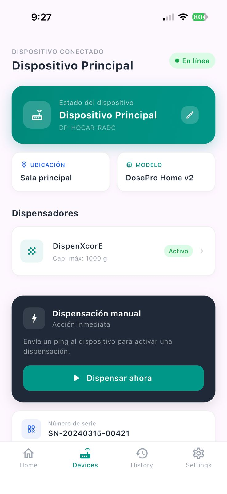

### PROBLEMA #3: El flujo para vincular a un cuidador requiere ingresar el ID del usuario, pero no hay un selector visual.

* **Severidad:** 4
* **Heurística violada:** Information Architecture - Is it usable?
* **Problema:** Para vincular un cuidador a un familiar, el usuario debe ingresar manualmente el ID del usuario a monitorear. Este campo es poco amigable, ya que la mayoría de los usuarios desconoce su ID y no hay una opción para buscarlo por nombre o correo electrónico. Esto puede bloquear completamente la tarea.
* **Recomendación:** Reemplazar el campo de texto por un selector desplegable (combobox) o un campo de búsqueda con autocompletado que permita encontrar al usuario por nombre o correo. Si el usuario no está en el sistema, se podría permitir enviar una invitación por correo.

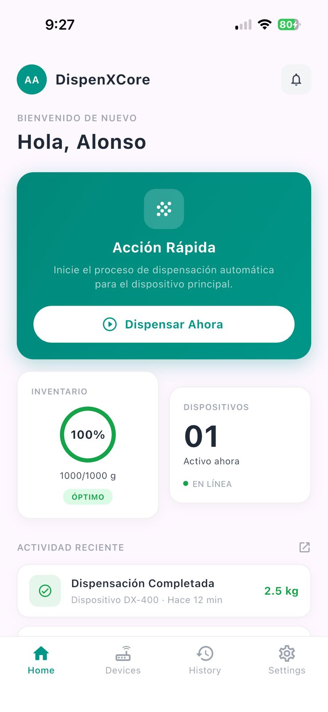


### PROBLEMA #4: No hay un botón claro para "Cancelar" o "Volver" en el formulario de configuración de alertas.

* **Severidad:** 3
* **Heurística violada:** Usability - Libertad y control del usuario
* **Problema:** Al acceder a la configuración de alertas, la única opción de salida es presionar "Guardar". No hay un enlace o botón para regresar al Dashboard sin guardar cambios, forzando al usuario a completar la tarea incluso si solo quería echar un vistazo.
* **Recomendación:** Añadir un botón de "Cancelar" o una "X" de cierre que redirija al usuario a la pantalla anterior sin guardar cambios. También se puede implementar un mensaje de confirmación si el usuario cierra con cambios pendientes.


### 6.4. Video About-the-Product

**VIDEO DEL ABOUT THE PRODUCT** [VIDEO](https://acortar.link/Dg3hwA)

## Conclusiones
1. DispenXCore demuestra que la integración de tecnologías IoT puede brindar una solución práctica a un problema cotidiano: la falta de control sobre los insumos básicos almacenados en el hogar o en pequeños negocios. Mediante el uso de sensores de peso, nivel y flujo, el proyecto permite transformar una alacena tradicional en un sistema inteligente capaz de monitorear el stock y anticipar situaciones de desabastecimiento.

2. El proyecto responde a una necesidad real de los usuarios: evitar compras de emergencia, reducir la incertidumbre sobre la cantidad disponible de productos y mejorar la planificación del consumo. Esta necesidad se vuelve más importante en hogares tecnológicos y en casos donde cuidadores necesitan supervisar de forma remota el estado de los insumos de familiares o personas con movilidad reducida.

3. Desde el punto de vista técnico, la solución logra integrar distintos componentes dentro de un mismo ecosistema: hardware con sensores, comunicación Wi-Fi, backend desarrollado en C#, aplicación web en Angular, aplicación móvil en Flutter y un servicio Edge para la interacción con el dispositivo físico. Esta integración permite validar el flujo de datos entre el dispensador IoT y las plataformas digitales del usuario.

4. La aplicación web y móvil fortalecen la experiencia del usuario, ya que permiten visualizar el estado actual del stock, recibir alertas, gestionar dispensadores y revisar información relevante de consumo. Además, el diseño de la solución prioriza la simplicidad, la claridad visual y la facilidad de uso, permitiendo que el sistema sea accesible tanto para usuarios con experiencia tecnológica como para usuarios menos familiarizados con herramientas digitales.

5. El desarrollo del proyecto por sprints permitió avanzar de manera ordenada e incremental, incorporando progresivamente la landing page, el backend, la aplicación web, la aplicación móvil y la conexión con el dispositivo IoT. Esto permitió organizar mejor las tareas del equipo, validar funcionalidades por etapas y mantener una trazabilidad del avance del producto.

6. Finalmente, DispenXCore se presenta como una propuesta con potencial de crecimiento, ya que puede iniciar como una solución doméstica para el monitoreo de granos y luego ampliarse hacia pequeños negocios, reportes avanzados, predicción de compras y analítica de consumo. Como mejora futura, se recomienda reforzar las pruebas con usuarios reales, optimizar la precisión de los sensores y fortalecer la estabilidad de la integración entre hardware, backend y aplicaciones.

## Bibliografía

- Gartner, Inc. (2025). *Forecast: Internet of Things — Endpoints and spending*. Gartner.
  https://www.gartner.com/en/information-technology/insights/internet-of-things

- Statista. (2024). *Smart home — Worldwide*.
  https://www.statista.com/outlook/dmo/smart-home/worldwide

- International Data Corporation (IDC). (2024). *Worldwide Internet of Things forecast*. IDC.
  https://www.idc.com/getdoc.jsp?containerId=prUS

- McKinsey & Company. (2023). *The state of smart homes*.
  https://www.mckinsey.com/industries/technology-media-and-telecommunications/our-insights

- Deloitte. (2024). *Connected consumer survey*. Deloitte Insights.
  https://www2.deloitte.com/global/en/insights/industry/technology/connected-consumer-survey.html

- Food and Agriculture Organization of the United Nations (FAO). (2023). *Food loss and waste database*.
  https://www.fao.org/platform-food-loss-waste

- World Bank. (2023). *Urban consumption patterns*.
  https://www.worldbank.org/en/topic/urbandevelopment

- Google. (2023). *Material design guidelines*.
  https://material.io/design

- Nielsen Norman Group. (2022). *Mobile UX and notification behavior*.
  https://www.nngroup.com/articles/mobile-notifications

- Institute of Electrical and Electronics Engineers (IEEE). (2023). *IoT systems and sensor integration*.
  https://ieeexplore.ieee.org

- Microsoft. (2024). *IoT architecture guide*.
  https://learn.microsoft.com/en-us/azure/architecture/iot


## **Anexos**

  **LANDING PAGE:** [LANDING PAGE](https://landing-dispenxcore.netlify.app/)

  **WEB APPLICATION:** [WEB APPLICATION](https://dispenxcore.netlify.app/)

  **BACKEND:** [BACKEND](https://dispenxcore-backend-production.up.railway.app/swagger/index.html)

  **WOKWI:** [WOKWI](https://wokwi.com/projects/467193835763547137)

  **EDGE:** [EDGE](https://dispenxcore-edge-agh9b0e7asakbdey.eastus-01.azurewebsites.net/)

  **PPT DEL PROYECTO:** [PPT](https://www.canva.com/design/DAGzQEpBtMs/zjEr8_HDH_y-mSaGu_7O3A/edit) 

  **VIDEO DEL PROYECTO:** [VIDEO](https://acortar.link/se3cmV)

  **VIDEO DEL ABOUT THE PRODUCT** [VIDEO](https://acortar.link/Dg3hwA)

  **VIDEO DEL ABOUT THE TEAM:** [VIDEO](https://acortar.link/VqEPVW)
